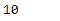

# 蟒蛇|熊猫期.月

> 原文:[https://www.geeksforgeeks.org/python-pandas-period-month/](https://www.geeksforgeeks.org/python-pandas-period-month/)

Python 是进行数据分析的优秀语言，主要是因为以数据为中心的 python 包的奇妙生态系统。 ***【熊猫】*** 就是其中一个包，让导入和分析数据变得容易多了。

熊猫 `**Period.month**`属性返回一个整数值。返回值表示给定期间对象中的月值。1 月 1 日到 12 月 12 日。

> **语法:**期间.月
> 
> **参数:**无
> 
> **返回:**月

**示例#1:** 使用`Period.month` 属性在给定的 Period 对象中查找月份值。

```
# importing pandas as pd
import pandas as pd

# Create the Period object
prd = pd.Period(freq ='S', year = 2000, month = 2,
                 day = 21, hour = 8, minute = 21)

# Print the Period object
print(prd)
```

**输出:**


现在我们将使用`Period.month`属性找出 prd 对象中月份的值。

```
# return value of month
prd.month
```

**输出:**


我们可以在输出中看到，`Period.month` 属性返回了 2，表示给定的期间对象将“二月”作为月份。

**示例#2:** 使用`Period.month`属性查找给定周期对象中月份的值。

```
# importing pandas as pd
import pandas as pd

# Create the Period object
prd = pd.Period(freq ='T', year = 2006, month = 10, hour = 15, minute = 49)

# Print the Period object
print(prd)
```

**输出:**


现在我们将使用`Period.month`属性找出 prd 对象中月份的值。

```
# return value of month
prd.month
```

**输出:**



正如我们在输出中看到的，`Period.month` 属性已经返回了 10，表示给定的期间对象已经将‘10 月’作为月份。