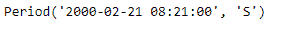
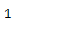
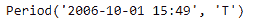
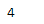

# 蟒蛇|熊猫时期.季度

> 原文:[https://www.geeksforgeeks.org/python-pandas-period-quarter/](https://www.geeksforgeeks.org/python-pandas-period-quarter/)

Python 是进行数据分析的优秀语言，主要是因为以数据为中心的 python 包的奇妙生态系统。 ***【熊猫】*** 就是其中一个包，让导入和分析数据变得容易多了。

熊猫 `**Period.quarter**`属性返回一个整数值。返回值表示给定期间对象中季度的值。

> **语法:**句点.季度
> 
> **参数:**无
> 
> **返回:**代表四分之一数值的整数值

**示例#1:** 使用`Period.quarter` 属性查找给定周期对象中四分之一的值。

```
# importing pandas as pd
import pandas as pd

# Create the Period object
prd = pd.Period(freq ='S', year = 2000, month = 2,
                  day = 21, hour = 8, minute = 21)

# Print the Period object
print(prd)
```

**输出:**


现在我们将使用`Period.quarter`属性找出 prd 对象中的季度值。

```
# return value of quarter
prd.quarter
```

**输出:**


我们可以在输出中看到，`Period.quarter` 属性已经返回 1，表示 prd 对象中的给定日期落在一年的第一季度。

**示例 2:** 使用`Period.quarter`属性查找给定周期对象中四分之一的值。

```
# importing pandas as pd
import pandas as pd

# Create the Period object
prd = pd.Period(freq ='T', year = 2006, month = 10,
                            hour = 15, minute = 49)

# Print the Period object
print(prd)
```

**输出:**


现在我们将使用`Period.quarter`属性找出 prd 对象中的季度值。

```
# return value of quarter
prd.quarter
```

**输出:**


我们可以在输出中看到，`Period.quarter` 属性已经返回 4，表示 prd 对象中的给定日期落在一年的第四季度。