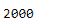
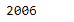

# 蟒蛇|熊猫时期. qyear

> 原文:[https://www.geeksforgeeks.org/python-pandas-period-qyear/](https://www.geeksforgeeks.org/python-pandas-period-qyear/)

Python 是进行数据分析的优秀语言，主要是因为以数据为中心的 python 包的奇妙生态系统。 ***【熊猫】*** 就是其中一个包，让导入和分析数据变得容易多了。

熊猫 `**Period.qyear**`属性根据其开始季度返回周期所在的财政年度。如果会计年度和日历年度相同，则期间的年度和 qyear 将相同。如果不是，会计年度可以不同于该期间的日历年度。

> **语法:** Period.qyear
> 
> **参数:**无
> 
> **收益:**会计年度

**示例#1:** 使用`Period.qyear` 属性查找给定期间对象的期间所在的会计年度。

```
# importing pandas as pd
import pandas as pd

# Create the Period object
prd = pd.Period(freq ='S', year = 2000, month = 2,
                  day = 21, hour = 8, minute = 21)

# Print the Period object
print(prd)
```

**输出:**


现在我们将使用`Period.qyear`属性来查找财政年度

```
# return the fiscal year
prd.qyear
```

**输出:**


正如我们在输出中看到的，`Period.qyear` 属性返回了 2000，表示给定的周期位于 2000 年。

**示例#2:** 使用`Period.qyear`属性查找给定期间对象的期间所在的会计年度。

```
# importing pandas as pd
import pandas as pd

# Create the Period object
prd = pd.Period(freq ='T', year = 2006, month = 10,
                            hour = 15, minute = 49)

# Print the Period object
print(prd)
```

**输出:**


现在我们将使用`Period.qyear`属性来查找财政年度

```
# return the fiscal year
prd.qyear
```

**输出:**



正如我们在输出中看到的，`Period.qyear` 属性返回了 2006 年，表示给定的时间段位于 2006 年。