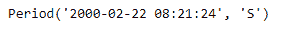
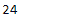
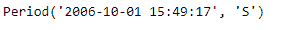
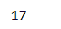

# 蟒蛇|熊猫时期.秒

> 原文:[https://www.geeksforgeeks.org/python-pandas-period-second/](https://www.geeksforgeeks.org/python-pandas-period-second/)

Python 是进行数据分析的优秀语言，主要是因为以数据为中心的 python 包的奇妙生态系统。 ***【熊猫】*** 就是其中一个包，让导入和分析数据变得容易多了。
熊猫**周期.秒**属性返回一个整数值，代表给定周期对象中的秒值。

> **语法:**周期.秒
> T3】参数:无
> T6】返回:秒

**示例#1:** 使用 Period.second 属性查找给定 Period 对象中存在的秒数值。

## 蟒蛇 3

```
# importing pandas as pd
import pandas as pd

# Create the Period object
prd = pd.Period(freq ='S', year = 2000, month = 2, day = 22,
                         hour = 8, minute = 21, second = 24)

# Print the Period object
print(prd)
```

**输出:**



现在我们将使用 Period.second 属性来查找给定周期对象中的秒数。

## 蟒蛇 3

```
# return the number of seconds
prd.second
```

**输出:**



正如我们在输出中看到的，Period.second 属性返回了 24，表明 prd 对象中的秒数是 24。
**示例#2:** 使用 Period.second 属性查找给定 Period 对象中存在的秒数值。

## 蟒蛇 3

```
# importing pandas as pd
import pandas as pd

# Create the Period object
prd = pd.Period(freq ='S', year = 2006, month = 10,
               hour = 15, minute = 49, second = 17)

# Print the Period object
print(prd)
```

**输出:**



现在我们将使用 Period.second 属性来查找给定周期对象中的秒数。

## 蟒蛇 3

```
# return the number of seconds
prd.second
```

**输出:**



正如我们在输出中看到的，Period.second 属性返回了 17，表示 prd 对象中的秒数是 17。