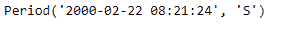
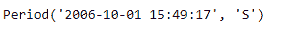
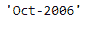

# python | pandas period . strftime

> 原文:[https://www . geesforgeks . org/python-pandas-period-str time/](https://www.geeksforgeeks.org/python-pandas-period-strftime/)

Python 是进行数据分析的优秀语言，主要是因为以数据为中心的 python 包的奇妙生态系统。 ***【熊猫】*** 就是其中一个包，让导入和分析数据变得容易多了。

熊猫 `**Period.strftime()**`函数根据所选格式返回句点的字符串表示形式。格式必须是包含一个或多个指令的字符串。该方法识别与标准 Python 发行版的`time.strftime()`功能相同的指令，以及特定的附加指令%f、%F、%q(格式化最初来自 scikits.timeries 的&文档)

> **语法:**period . str time()
> 
> **参数:**格式
> 
> **返回:**字符串

**示例#1:** 使用`Period.strftime()`函数以指定的格式返回给定周期的值。

```
# importing pandas as pd
import pandas as pd

# Create the Period object
prd = pd.Period(freq ='S', year = 2000, month = 2, day = 22, 
                        hour = 8, minute = 21, second = 24)

# Print the Period object
print(prd)
```

**输出:**



现在我们将使用`Period.strftime()`函数以(' %b. %d，%Y 是%A ')格式返回给定的周期。

**注:** `'%b'`为月名，`%d`为一月中的日，`%Y`为年，`%A`为工作日名。

```
# return the period in specified format.
prd.strftime('% b. % d, % Y was a % A')
```

**输出:**


正如我们在输出中看到的，`Period.strftime()`函数已经以指定的格式返回了给定周期的值。

**示例 2:** 使用`Period.strftime()`函数以指定的格式返回给定期间的值。

```
# importing pandas as pd
import pandas as pd

# Create the Period object
prd = pd.Period(freq ='S', year = 2006, month = 10, 
               hour = 15, minute = 49, second = 17)

# Print the object
print(prd)
```

**输出:**



现在我们将使用`Period.strftime()`函数以(' %b-%Y ')格式返回给定的周期。

**注:** `'%b'`为月名，`%Y`为年

```
# return the period in specified format.
prd.strftime('% b-% Y')
```

**输出:**


正如我们在输出中看到的，`Period.strftime()`函数已经以指定的格式返回了给定周期的值。