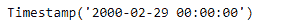
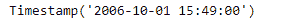

# Python | Pandas period . to _ timestamp

> 原文:[https://www . geesforgeks . org/python-pandas-period-to _ timestamp/](https://www.geeksforgeeks.org/python-pandas-period-to_timestamp/)

Python 是进行数据分析的优秀语言，主要是因为以数据为中心的 python 包的奇妙生态系统。 ***【熊猫】*** 就是其中一个包，让导入和分析数据变得容易多了。

Pandas `**Period.to_timestamp()**`函数在指定的周期结束(方式)时，以目标频率返回周期的时间戳表示。

> **语法:** Period.to_timestamp()
> 
> **参数:**
> **频率:**目标频率。如果 self.freq 为一周或更长时间，则默认为“D”，否则为“S”
> **how:**“S”，“E”。可以别名为不区分大小写的“开始”、“完成”、“开始”、“结束”
> 
> **返回:**时间戳

**示例#1:** 使用`Period.to_timestamp()`函数以指定的频率将给定的周期对象作为时间戳对象返回。

```py
# importing pandas as pd
import pandas as pd

# Create the Period object
prd = pd.Period(freq ='S', year = 2000, month = 2, day = 22,
                         hour = 8, minute = 21, second = 24)

# Print the Period object
print(prd)
```

**输出:**


现在我们将使用`Period.to_timestamp()`函数返回给定的周期对象作为时间戳对象。

```py
# return as a timestamp in the specified frequency.
# 'M' represents monthly frequency
prd.to_timestamp(freq ='M')
```

**输出:**



正如我们在输出中看到的，`Period.to_timestamp()`函数以指定的频率返回给定的周期对象作为时间戳。

**示例 2:** 使用`Period.to_timestamp()`函数以指定的频率将给定的周期对象作为时间戳对象返回。

```py
# importing pandas as pd
import pandas as pd

# Create the Period object
prd = pd.Period(freq ='S', year = 2006, month = 10,
               hour = 15, minute = 49, second = 17)

# Print the object
print(prd)
```

**输出:**


现在我们将使用`Period.to_timestamp()`函数返回给定的周期对象作为时间戳对象。

```py
# return as a timestamp in the specified frequency.
# 'T' represents minutely frequency
prd.to_timestamp(freq ='T')
```

**输出:**


正如我们在输出中看到的，`Period.to_timestamp()`函数以指定的频率返回给定的周期对象作为时间戳。