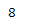
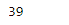

# 蟒蛇|熊猫周

> 原文:[https://www.geeksforgeeks.org/python-pandas-period-week/](https://www.geeksforgeeks.org/python-pandas-period-week/)

Python 是进行数据分析的优秀语言，主要是因为以数据为中心的 python 包的奇妙生态系统。 ***【熊猫】*** 就是其中一个包，让导入和分析数据变得容易多了。

熊猫 `**Period.week**`属性返回一个整数值，代表给定周期所在的周数。

> **语法:**句点.周
> 
> **参数:**无
> 
> **返回:**一年中的一周

**示例#1:** 使用`Period.week`属性找出给定周期对象所在的周。

```py
# importing pandas as pd
import pandas as pd

# Create the Period object
prd = pd.Period(freq ='S', year = 2000, month = 2, day = 22, 
                        hour = 8, minute = 21, second = 24)

# Print the Period object
print(prd)
```

**输出:**


现在我们将使用`Period.week`属性来查找 prd 对象所在的周。

```py
# return the week value
prd.week
```

**输出:**


正如我们在输出中看到的，`Period.week` 属性返回了 8，表示下一个周期对象位于给定年份的第 8 周。

**例 2:** 使用`Period.week`属性找出给定期间对象所在的周。

```py
# importing pandas as pd
import pandas as pd

# Create the Period object
prd = pd.Period(freq ='S', year = 2006, month = 10,
               hour = 15, minute = 49, second = 17)

# Print the object
print(prd)
```

**输出:**

现在我们将使用`Period.week`属性来查找 prd 对象所在的周。

```py
# return the week value
prd.week
```

**输出:**


正如我们在输出中看到的，`Period.week` 属性返回了 39，表示下一个周期对象位于给定年份的第 39 周。