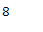
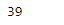

# 蟒蛇|熊猫一年一周

> 原文:[https://www . geesforgeks . org/python-pandas-period-weekof year/](https://www.geeksforgeeks.org/python-pandas-period-weekofyear/)

Python 是进行数据分析的优秀语言，主要是因为以数据为中心的 python 包的奇妙生态系统。 ***【熊猫】*** 就是其中一个包，让导入和分析数据变得容易多了。
熊猫 **Period.weekofyear** 属性返回一个整数值，该整数值是给定 Period 对象的一年中的周数。

> **语法:**一年中的某周
> T3】参数:无
> T6】返回:一年中的某周

**示例#1:** 使用 Period.weekofyear 属性查找给定 Period 对象的周数。

## 蟒蛇 3

```py
# importing pandas as pd
import pandas as pd

# Create the Period object
prd = pd.Period(freq ='S', year = 2000, month = 2,
                  day = 21, hour = 8, minute = 21)

# Print the Period object
print(prd)
```

**输出:**


现在我们将使用 Period.weekofyear 属性来查找一年中的周数

## 蟒蛇 3

```py
# return week number for the year
prd.weekofyear
```

**输出:**



正如我们在输出中看到的，Period.weekofyear 属性返回了 8，表示 prd 对象中的周期位于一年中的第 8 周。
**示例#2:** 使用 Period.weekofyear 属性查找给定 Period 对象的周数。

## 蟒蛇 3

```py
# importing pandas as pd
import pandas as pd

# Create the Period object
prd = pd.Period(freq ='T', year = 2006, month = 10,
                            hour = 15, minute = 49)

# Print the Period object
print(prd)
```

**输出:**


现在我们将使用 Period.weekofyear 属性来查找一年中的周数

## 蟒蛇 3

```py
# return week number for the year
prd.weekofyear
```

**输出:**



正如我们在输出中看到的，Period.weekofyear 属性返回了 39，表示 prd 对象中的周期位于一年中的第 39 周。