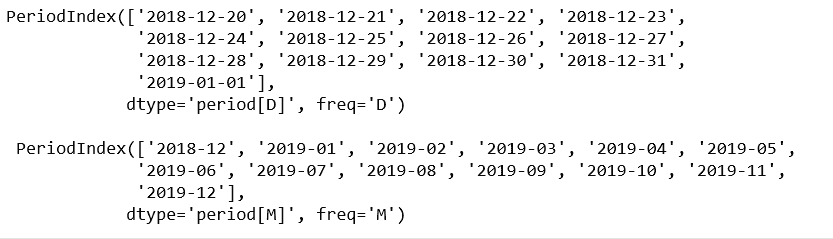
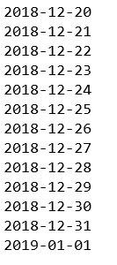
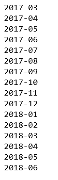

# 蟒蛇|熊猫. period_range()方法

> 原文:[https://www . geesforgeks . org/python-pandas-period _ range-method/](https://www.geeksforgeeks.org/python-pandas-period_range-method/)

Python 是进行数据分析的优秀语言，主要是因为以数据为中心的 python 包的奇妙生态系统。Pandas 就是其中之一，它让数据的导入和分析变得更加容易。

`**pandas.period_range()**`是 Pandas 中的通用函数之一，用于返回固定频率的 PeriodIndex，默认频率为日(日历)。

> **语法:** pandas.to_numeric(arg，错误='raise '，downcast=None)
> 
> **参数:**
> **开始:**生成周期的左界
> **结束:**生成周期的右界
> **周期:**生成的周期数
> **频率:**频率别名
> **名称:**结果周期索引的名称
> 
> **返回:**周期索引

**代码#1:**

```py
# importing pandas as pd
import pandas as pd

# period_range with freq = day
per1 = pd.period_range(start ='2018-12-20',
              end ='2019-01-01', freq ='D')

# period_range with freq = month
per2 = pd.period_range(start ='2018-12-20',
              end ='2019-12-01', freq ='M')

print(per1, "\n\n", per2)
```

**输出:**


**代码#2:**

```py
# importing pandas as pd
import pandas as pd

# period_range with freq = day
per1 = pd.period_range(start ='2018-12-20', 
              end ='2019-01-01', freq ='D')

for val in per1:
    print(val)
```

**输出:**


**代码#3:**

```py
# importing pandas as pd
import pandas as pd

# Calling with pd.Period
per = pd.period_range(start = pd.Period('2017Q1', freq ='Q'),
                end = pd.Period('2018Q2', freq ='Q'), freq ='M')

for val in per:
    print(val)
```

**输出:**
