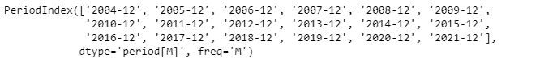
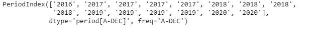

# 蟒蛇|熊猫 PeriodIndex.asfreq

> 原文:[https://www . geesforgeks . org/python-pandas-period index-as freq/](https://www.geeksforgeeks.org/python-pandas-periodindex-asfreq/)

Python 是进行数据分析的优秀语言，主要是因为以数据为中心的 python 包的奇妙生态系统。 ***【熊猫】*** 就是其中一个包，让导入和分析数据变得容易多了。

熊猫 `**PeriodIndex.asfreq()**`函数将给定周期索引对象的每个元素转换为指定的频率。

> **语法:**period index . asfreq(freq =无，how='E ')
> 
> **参数:**
> **freq :** 一个频率
> **how:**“E”、“END”或“FINISH”表示结束，“S”、“START”或“BEGIN”表示开始。
> 
> **返回:**新频率的周期索引

**示例#1:** 使用`PeriodIndex.asfreq()`功能将给定周期索引对象的频率转换为指定的时间序列频率。

```
# importing pandas as pd
import pandas as pd

# Create the PeriodIndex object
pidx = pd.PeriodIndex(start ='2004-11-11 02:45:21 ', 
                end ='2021-5-21 8:45:29', freq ='Y')

# Print the PeriodIndex object
print(pidx)
```

**输出:**


现在我们将使用`PeriodIndex.asfreq()`函数将给定 PeriodIndex 对象的时间序列频率转换为指定频率。

```
# convert the frequency
# 'M' stands for monthly frequency
pidx.asfreq('M')
```

**输出:**



我们可以在输出中看到，`PeriodIndex.asfreq()`函数已经将给定 PeriodIndex 对象的频率转换为指定的频率。

**示例 2:** 使用`PeriodIndex.asfreq()`函数将给定周期索引对象的频率转换为指定的时间序列频率。

```
# importing pandas as pd
import pandas as pd

# Create the PeriodIndex object
pidx = pd.PeriodIndex(start ='2016-10-12 11:12:02', 
             end ='2020-04-12 11:32:12', freq ='Q')

# Print the PeriodIndex object
print(pidx)
```

**输出:**


现在我们将使用`PeriodIndex.asfreq()`函数将给定 PeriodIndex 对象的时间序列频率转换为指定频率。

```
# convert the frequency
# 'Y' stands for yearly frequency
pidx.asfreq('Y')
```

**输出:**



我们可以在输出中看到，`PeriodIndex.asfreq()`函数已经将给定 PeriodIndex 对象的频率转换为指定的频率。