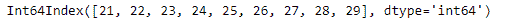
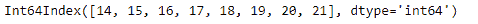

# 蟒蛇|熊猫 PeriodIndex.day

> 原文:[https://www . geesforgeks . org/python-pandas-period index-day/](https://www.geeksforgeeks.org/python-pandas-periodindex-day/)

Python 是进行数据分析的优秀语言，主要是因为以数据为中心的 python 包的奇妙生态系统。 ***【熊猫】*** 就是其中一个包，让导入和分析数据变得容易多了。
Pandas**PeriodIndex . day**属性返回一个 Index 对象，该对象包含给定 period Index 对象中每个元素的天数值。

> **语法:**period index . day
> T3】参数:None
> T6】Return:days

**示例#1:** 使用 PeriodIndex.day 属性查找给定 PeriodIndex 对象中每个元素的天数值。

## 蟒蛇 3

```py
# importing pandas as pd
import pandas as pd

# Create the PeriodIndex object
pidx = pd.PeriodIndex(start ='2005-12-21',
             end ='2005-12-29', freq ='D')

# Print the PeriodIndex object
print(pidx)
```

**输出:**


现在我们将使用 PeriodIndex.day 属性来查找给定对象中每个元素的天数值。

## 蟒蛇 3

```py
# return the value of days
pidx.day
```

**输出:**



正如我们在输出中看到的，PeriodIndex.day 属性返回了一个 Index 对象，该对象包含给定 PeriodIndex 对象中每个元素的天数值。
**示例#2:** 使用 PeriodIndex.day 属性查找给定 PeriodIndex 对象中每个元素的天数值。

## 蟒蛇 3

```py
# importing pandas as pd
import pandas as pd

# Create the PeriodIndex object
pidx = pd.PeriodIndex(start ='2011-03-14 ',
              end ='2011-03-21', freq ='D')

# Print the PeriodIndex object
print(pidx)
```

**输出:**


现在我们将使用 PeriodIndex.day 属性来查找给定对象中每个元素的天数值。

## 蟒蛇 3

```py
# return the value of days
pidx.day
```

**输出:**



正如我们在输出中看到的，PeriodIndex.day 属性返回了一个 Index 对象，该对象包含给定 PeriodIndex 对象中每个元素的天数值。