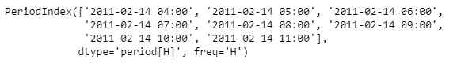
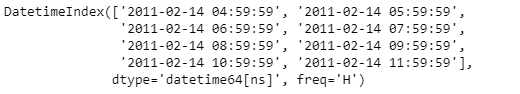

# Python | Pandas period index . end _ time

> 原文:[https://www . geesforgeks . org/python-pandas-period index-end _ time/](https://www.geeksforgeeks.org/python-pandas-periodindex-end_time/)

Python 是进行数据分析的优秀语言，主要是因为以数据为中心的 python 包的奇妙生态系统。 ***【熊猫】*** 就是其中一个包，让导入和分析数据变得容易多了。

pandas**period Index . end _ time**属性返回一个 Index 对象。索引包含给定周期索引对象中每个元素的周期结束时间。

> **语法:**period Index . end _ time
> T3】参数:None
> T6】返回: Index

**示例#1:** 使用 PeriodIndex.end_time 属性查找给定 PeriodIndex 对象中每个元素的周期结束时间。

## 蟒蛇 3

```
# importing pandas as pd
import pandas as pd

# Create the PeriodIndex object
pidx = pd.PeriodIndex(start ='2005-12-21 08:45 ',
              end ='2005-12-21 11:55', freq ='H')

# Print the PeriodIndex object
print(pidx)
```

**输出:**


现在我们将使用 PeriodIndex.end_time 属性来查找给定对象中每个元素的周期结束时间。

## 蟒蛇 3

```
# return the end time of period
pidx.end_time
```

**输出:**


正如我们在输出中看到的，PeriodIndex.end_time 属性返回了一个 Index 对象，该对象包含给定 PeriodIndex 对象中每个元素的周期结束时间。

**示例#2:** 使用 PeriodIndex.end_time 属性查找给定 PeriodIndex 对象中每个元素的周期结束时间。

## 蟒蛇 3

```
# importing pandas as pd
import pandas as pd

# Create the PeriodIndex object
pidx = pd.PeriodIndex(start ='2011-02-14 04:30',
             end ='2011-02-14 11:44', freq ='H')

# Print the PeriodIndex object
print(pidx)
```

**输出:**



现在我们将使用 PeriodIndex.end_time 属性来查找给定对象中每个元素的周期结束时间。

## 蟒蛇 3

```
# return the end time of period
pidx.end_time
```

**输出:**



正如我们在输出中看到的，PeriodIndex.end_time 属性返回了一个 Index 对象，该对象包含给定 PeriodIndex 对象中每个元素的周期结束时间。