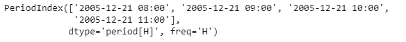
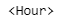
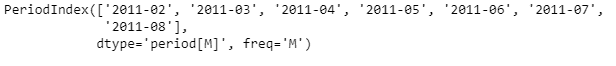
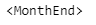

# 蟒蛇|熊猫 PeriodIndex.freq

> 原文:[https://www . geesforgeks . org/python-pandas-period index-freq/](https://www.geeksforgeeks.org/python-pandas-periodindex-freq/)

Python 是进行数据分析的优秀语言，主要是因为以数据为中心的 python 包的奇妙生态系统。 ***【熊猫】*** 就是其中一个包，让导入和分析数据变得容易多了。

Pandas **PeriodIndex.freq** 属性返回应用于给定 PeriodIndex 对象的时间序列频率。

> **语法:**period Index . freq
> T3】参数:None
> T6】返回: Index

**示例#1:** 使用 PeriodIndex.freq 属性查找给定 PeriodIndex 对象的时间序列频率。

## 蟒蛇 3

```py
# importing pandas as pd
import pandas as pd

# Create the PeriodIndex object
pidx = pd.PeriodIndex(start='2005-12-21 08:45 ',
              end='2005-12-21 11:55', freq='H')

# Print the PeriodIndex object
print(pidx)
```

**输出:**



现在我们将使用 PeriodIndex.freq 属性来查找给定对象的时间序列频率。

## 蟒蛇 3

```py
# return the frequency
pidx.freq
```

**输出:**



正如我们在输出中看到的，PeriodIndex.freq 属性返回了“每小时”的频率。这是应用于给定周期索引对象的时间序列频率。

**示例#2:** 使用 PeriodIndex.freq 属性查找给定 PeriodIndex 对象的时间序列频率。

## 蟒蛇 3

```py
# importing pandas as pd
import pandas as pd

# Create the PeriodIndex object
pidx = pd.PeriodIndex(start='2011-02-1 ',
             end='2011-08-14', freq='M')

# Print the PeriodIndex object
print(pidx)
```

**输出:**



现在我们将使用 PeriodIndex.freq 属性来查找给定对象的时间序列频率。

## 蟒蛇 3

```py
# return the frequency
pidx.freq
```

**输出:**



正如我们在输出中看到的，PeriodIndex.freq 属性返回了“Monthly”频率。这是应用于给定周期索引对象的时间序列频率。