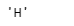
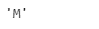

# Python |熊猫周期指数。freqstr

> 原文:[https://www . geesforgeks . org/python-pandas-period index-freqstr/](https://www.geeksforgeeks.org/python-pandas-periodindex-freqstr/)

Python 是进行数据分析的优秀语言，主要是因为以数据为中心的 python 包的奇妙生态系统。 ***【熊猫】*** 就是其中一个包，让导入和分析数据变得容易多了。

pandas**PeriodIndex . freqstr**属性将频率对象作为字符串返回(如果设置了该属性)，否则该函数将为给定的 period index 对象返回 None。

> **语法:** PeriodIndex.freqstr
> 
> **参数:**无
> 
> **返回:**频率为字符串

**示例#1:** 使用 PeriodIndex.freqstr 属性查找应用于给定 PeriodIndex 对象的时间序列频率。

## 蟒蛇 3

```
# importing pandas as pd
import pandas as pd

# Create the PeriodIndex object
pidx = pd.PeriodIndex(start ='2005-12-21 08:45 ',
              end ='2005-12-21 11:55', freq ='H')

# Print the PeriodIndex object
print(pidx)
```

**输出:**


现在我们将使用 PeriodIndex.freqstr 属性来查找给定对象的时间序列频率。

## 蟒蛇 3

```
# return the frequency object as a string
pidx.freqstr
```

**输出:**



正如我们在输出中看到的，PeriodIndex.freqstr 属性返回了“H”，表示每小时的频率应用于给定的 PeriodIndex 对象。

**示例#2:** 使用 PeriodIndex.freqstr 属性查找给定 PeriodIndex 对象的时间序列频率。

## 蟒蛇 3

```
# importing pandas as pd
import pandas as pd

# Create the PeriodIndex object
pidx = pd.PeriodIndex(start ='2011-02-1 ',
             end ='2011-08-14', freq ='M')

# Print the PeriodIndex object
print(pidx)
```

**输出:**


现在我们将使用 PeriodIndex.freqstr 属性来查找给定对象的时间序列频率。

## 蟒蛇 3

```
# return the frequency object as a string
pidx.freqstr
```

**输出:**



正如我们在输出中看到的，PeriodIndex.freqstr 属性返回了“M”，表示每月的频率应用于给定的 PeriodIndex 对象。