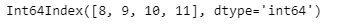
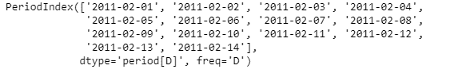
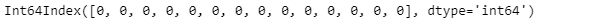

# 蟒蛇|熊猫 PeriodIndex.hour

> 原文:[https://www . geesforgeks . org/python-pandas-period index-hour/](https://www.geeksforgeeks.org/python-pandas-periodindex-hour/)

Python 是进行数据分析的优秀语言，主要是因为以数据为中心的 python 包的奇妙生态系统。 ***【熊猫】*** 就是其中一个包，让导入和分析数据变得容易多了。

熊猫 `**PeriodIndex.hour**`属性返回给定周期索引对象的周期小时数。

> **语法:**周期索引.小时
> 
> **参数:**无
> 
> **返回:**包含小时值的索引对象。

**示例#1:** 使用`PeriodIndex.hour`属性查找给定周期索引对象的周期小时值。

```py
# importing pandas as pd
import pandas as pd

# Create the PeriodIndex object
pidx = pd.PeriodIndex(start ='2005-12-21 08:45 ', 
              end ='2005-12-21 11:55', freq ='H')

# Print the PeriodIndex object
print(pidx)
```

**输出:**


现在我们将使用`PeriodIndex.hour`属性来查找给定对象中的时段的小时。

```py
# return the hour value
pidx.hour
```

**输出:**



正如我们在输出中看到的那样，`PeriodIndex.hour`属性返回了一个包含给定周期索引对象的每个元素的小时值的索引对象。

**示例 2:** 使用`PeriodIndex.hour`属性查找给定周期索引对象的周期小时数。

```py
# importing pandas as pd
import pandas as pd

# Create the PeriodIndex object
pidx = pd.PeriodIndex(start ='2011-02-1', 
           end ='2011-02-14', freq ='D')

# Print the PeriodIndex object
print(pidx)
```

**输出:**



现在我们将使用`PeriodIndex.hour`属性来查找给定对象中周期的小时值。

```py
# return the hour value
pidx.hour
```

**输出:**



正如我们在输出中看到的那样，`PeriodIndex.hour`属性返回了一个包含给定周期索引对象的每个元素的小时值的索引对象。正如我们可以看到的，对于 pidx 对象，我们应用了每日频率。因此，没有设置小时值，因此函数为所有元素返回了 0。