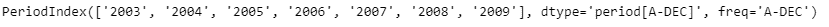
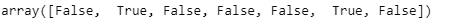
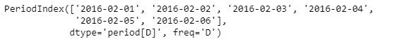
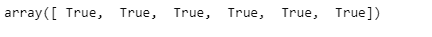

# 蟒蛇|熊猫 PeriodIndex.is_leap_year

> 原文:[https://www . geesforgeks . org/python-pandas-period index-is _ leap _ year/](https://www.geeksforgeeks.org/python-pandas-periodindex-is_leap_year/)

Python 是进行数据分析的优秀语言，主要是因为以数据为中心的 python 包的奇妙生态系统。 ***【熊猫】*** 就是其中一个包，让导入和分析数据变得容易多了。

Pandas `**PeriodIndex.is_leap_year**`属性返回对应于 PeriodIndex 对象中每个元素的布尔值数组。如果给定年份是闰年，它将返回`True`，否则如果不是闰年，它将返回`False`。

> **语法:** PeriodIndex.is_leap_year
> 
> **参数:**无
> 
> **返回:**布尔值数组

**示例#1:** 使用`PeriodIndex.is_leap_year`属性检查给定周期索引对象中的每个元素，无论它是否是闰年。

```
# importing pandas as pd
import pandas as pd

# Create the PeriodIndex object
pidx = pd.PeriodIndex(start ='2003-12-21 08:45 ',
              end ='2009-12-21 11:55', freq ='Y')

# Print the PeriodIndex object
print(pidx)
```

**输出:**


现在我们将使用`PeriodIndex.is_leap_year`属性来检查给定的年份是否是闰年。

```
# check for leap year
pidx.is_leap_year
```

**输出:**


正如我们在输出中看到的那样，`PeriodIndex.is_leap_year`属性返回了一个包含布尔值的数组。`True`表示给定年份是闰年，`False`表示给定年份不是闰年。

**示例 2:** 使用`PeriodIndex.is_leap_year`属性检查给定 PeriodIndex 对象中的每个元素，无论它是否是闰年。

```
# importing pandas as pd
import pandas as pd

# Create the PeriodIndex object
pidx = pd.PeriodIndex(start ='2016-02-1', 
           end ='2016-02-06', freq ='D')

# Print the PeriodIndex object
print(pidx)
```

**输出:**



现在我们将使用`PeriodIndex.is_leap_year`属性来检查给定的年份是否是闰年。

```
# check for leap year
pidx.is_leap_year
```

**输出:**



正如我们在输出中看到的那样，`PeriodIndex.is_leap_year`属性返回了一个包含布尔值的数组。`True`表示给定年份是闰年，`False`表示给定年份不是闰年。