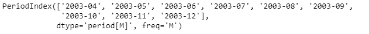
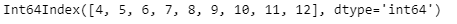
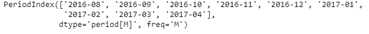
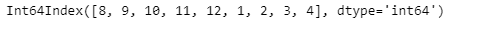

# 蟒蛇|熊猫 PeriodIndex.month

> 原文:[https://www . geesforgeks . org/python-pandas-period index-month/](https://www.geeksforgeeks.org/python-pandas-periodindex-month/)

Python 是进行数据分析的优秀语言，主要是因为以数据为中心的 python 包的奇妙生态系统。 ***【熊猫】*** 就是其中一个包，让导入和分析数据变得容易多了。

熊猫 `**PeriodIndex.month**`属性返回一个 Index 对象，该对象包含给定周期 Index 对象中每个周期的月份值。月份编号为 1 月=1 到 12 月=12。

> **语法:**周期索引.月
> 
> **参数:**无
> 
> **返回:**索引对象

**示例#1:** 使用`PeriodIndex.month`属性找出给定周期索引对象中每个周期的月份值。

```
# importing pandas as pd
import pandas as pd

# Create the PeriodIndex object
pidx = pd.PeriodIndex(start ='2003-4-21 08:45 ', 
              end ='2003-12-21 8:55', freq ='M')

# Print the PeriodIndex object
print(pidx)
```

**输出:**


现在我们将使用`PeriodIndex.month`属性找出 pidx 中每个期间的月值。

```
# return month value
pidx.month
```

**输出:**

正如我们在输出中看到的，`PeriodIndex.month`属性有一个包含给定 PeriodIndex 对象中每个期间的月值的索引对象。

**示例 2:** 使用`PeriodIndex.month`属性找出给定 PeriodIndex 对象中每个期间的月值。

```
# importing pandas as pd
import pandas as pd

# Create the PeriodIndex object
pidx = pd.PeriodIndex(start ='2016-8-12 11:32', 
          end ='2017-04-05 11:55', freq ='M')

# Print the PeriodIndex object
print(pidx)
```

**输出:**


现在我们将使用`PeriodIndex.month`属性找出 pidx 中每个期间的月值。

```
# return month value
pidx.month
```

**输出:**

正如我们在输出中看到的，`PeriodIndex.month`属性有一个包含给定 PeriodIndex 对象中每个期间的月值的索引对象。