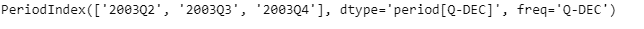
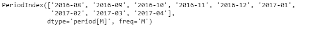
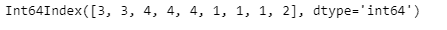

# 蟒蛇|熊猫 PeriodIndex.quarter

> 原文:[https://www . geesforgeks . org/python-pandas-period index-quarter/](https://www.geeksforgeeks.org/python-pandas-periodindex-quarter/)

Python 是进行数据分析的优秀语言，主要是因为以数据为中心的 python 包的奇妙生态系统。 ***【熊猫】*** 就是其中一个包，让导入和分析数据变得容易多了。

熊猫 `**PeriodIndex.quarter**`属性返回一个索引对象，该对象包含给定周期索引对象中每个周期的四分之一日期。

> **语法:**周期索引.季度
> 
> **参数:**无
> 
> **返回:**索引对象

**示例#1:** 使用`PeriodIndex.quarter`属性找出给定周期索引对象中每个周期的日期季度。

```
# importing pandas as pd
import pandas as pd

# Create the PeriodIndex object
pidx = pd.PeriodIndex(start ='2003-4-21 08:45 ',
              end ='2003-12-21 8:55', freq ='Q')

# Print the PeriodIndex object
print(pidx)
```

**输出:**


现在我们将使用`PeriodIndex.quarter`属性找出 pidx 中每个时间段的日期季度。

```
# return the quarter of each date
pidx.quarter
```

**输出:**

正如我们在输出中看到的，`PeriodIndex.quarter`属性返回了一个包含给定周期索引对象的季度值的索引对象。

**示例 2:** 使用`PeriodIndex.quarter`属性找出给定 PeriodIndex 对象中每个期间的日期季度。

```
# importing pandas as pd
import pandas as pd

# Create the PeriodIndex object
pidx = pd.PeriodIndex(start ='2016-8-12 11:32', 
            end ='2017-04-05 11:55', freq ='M')

# Print the PeriodIndex object
print(pidx)
```

**输出:**


现在我们将使用`PeriodIndex.quarter`属性找出 pidx 中每个时间段的日期季度。

```
# return the quarter of each date
pidx.quarter
```

**输出:**

正如我们在输出中看到的，`PeriodIndex.quarter`属性返回了一个包含给定周期索引对象的季度值的索引对象。