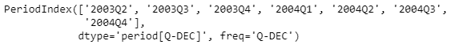
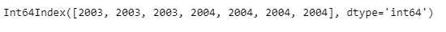
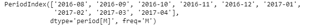
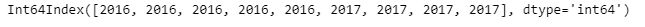

# 蟒蛇|熊猫 PeriodIndex.qyear

> 原文:[https://www . geesforgeks . org/python-pandas-period index-qyear/](https://www.geeksforgeeks.org/python-pandas-periodindex-qyear/)

Python 是进行数据分析的优秀语言，主要是因为以数据为中心的 python 包的奇妙生态系统。 ***【熊猫】*** 就是其中一个包，让导入和分析数据变得容易多了。

Pandas `**PeriodIndex.qyear**`属性返回一个 Index 对象，该对象包含根据起始季度的会计年度。如果会计年度和日历年度相同，则期间的年度和 qyear 将相同。如果不是，会计年度可以不同于该期间的日历年度。

> **语法:** PeriodIndex.qyear
> 
> **参数:**无
> 
> **返回:**索引对象

**示例#1:** 使用`PeriodIndex.qyear`属性找出给定周期索引对象中每个周期所在的会计年度。

```py
# importing pandas as pd
import pandas as pd

# Create the PeriodIndex object
pidx = pd.PeriodIndex(start ='2003-4-21 08:45 ',
             end ='2004-11-21 8:55', freq ='Q')

# Print the PeriodIndex object
print(pidx)
```

**输出:**


现在我们将使用`PeriodIndex.qyear`属性找出 pidx 中每个期间的会计年度。

```py
# return the fiscal year of the period
pidx.qyear
```

**输出:**

正如我们在输出中看到的，`PeriodIndex.qyear`属性返回了一个 Index 对象，该对象包含给定 PeriodIndex 对象的每个期间的会计年度。

**示例#2:** 使用`PeriodIndex.qyear`属性找出给定 PeriodIndex 对象中每个期间所在的会计年度。

```py
# importing pandas as pd
import pandas as pd

# Create the PeriodIndex object
pidx = pd.PeriodIndex(start ='2016-8-12 11:32', 
            end ='2017-04-05 11:55', freq ='M')

# Print the PeriodIndex object
print(pidx)
```

**输出:**


现在我们将使用`PeriodIndex.qyear`属性找出 pidx 中每个期间的会计年度。

```py
# return the fiscal year of the period
pidx.qyear
```

**输出:**

正如我们在输出中看到的，`PeriodIndex.qyear`属性返回了一个 Index 对象，该对象包含给定 PeriodIndex 对象的每个期间的会计年度。