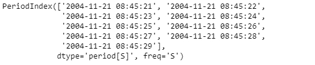
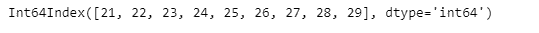
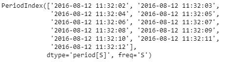
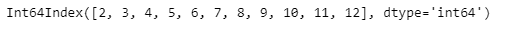

# 蟒蛇|熊猫 PeriodIndex.second

> 原文:[https://www . geesforgeks . org/python-pandas-period index-second/](https://www.geeksforgeeks.org/python-pandas-periodindex-second/)

Python 是进行数据分析的优秀语言，主要是因为以数据为中心的 python 包的奇妙生态系统。 ***【熊猫】*** 就是其中一个包，让导入和分析数据变得容易多了。

熊猫 `**PeriodIndex.second**`属性返回一个索引对象，该对象包含给定周期索引对象中每个周期元素的第二个值。

> **语法:**周期索引.秒
> 
> **参数:**无
> 
> **返回:**索引对象

**示例#1:** 使用`PeriodIndex.second`属性找出给定周期索引对象中每个周期元素的第二个值。

```py
# importing pandas as pd
import pandas as pd

# Create the PeriodIndex object
pidx = pd.PeriodIndex(start ='2004-11-21 08:45:21 ', 
               end ='2004-11-21 8:45:29', freq ='S')

# Print the PeriodIndex object
print(pidx)
```

**输出:**



现在我们将使用`PeriodIndex.second`属性找出 pidx 对象中每个周期元素的第二个值。

```py
# return the second values
pidx.second
```

**输出:**



正如我们在输出中看到的那样，`PeriodIndex.second`属性返回了包含给定周期索引对象中每个周期的秒值的秒对象。

**示例 2:** 使用`PeriodIndex.second`属性找出给定周期索引对象中每个周期元素的第二个值。

```py
# importing pandas as pd
import pandas as pd

# Create the PeriodIndex object
pidx = pd.PeriodIndex(start ='2016-8-12 11:32:02', 
            end ='2016-08-12 11:32:12', freq ='S')

# Print the PeriodIndex object
print(pidx)
```

**输出:**



现在我们将使用`PeriodIndex.second`属性找出 pidx 对象中每个周期元素的第二个值。

```py
# return the second values
pidx.second
```

**输出:**


正如我们在输出中看到的那样，`PeriodIndex.second`属性返回了一个索引对象，该对象包含给定周期索引对象中每个周期的秒值。