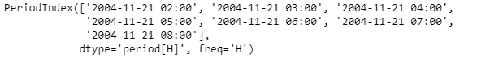
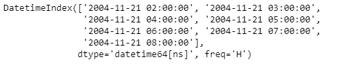
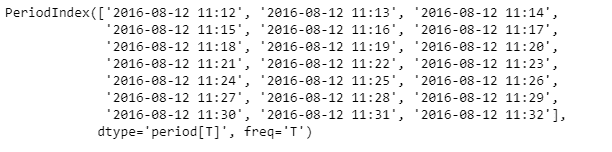
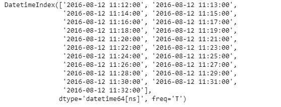

# Python | Pandas period index . start _ time

> 原文:[https://www . geesforgeks . org/python-pandas-period index-start _ time/](https://www.geeksforgeeks.org/python-pandas-periodindex-start_time/)

Python 是进行数据分析的优秀语言，主要是因为以数据为中心的 python 包的奇妙生态系统。 ***【熊猫】*** 就是其中一个包，让导入和分析数据变得容易多了。

Pandas `**PeriodIndex.start_time**`属性返回一个 DatetimeIndex 对象，该对象包含给定周期索引对象中每个周期元素的开始时间。

> **语法:**周期索引.开始时间
> 
> **参数:**无
> 
> **返回:**日期时间索引对象

**示例#1:** 使用`PeriodIndex.start_time`属性找出给定周期索引对象中每个周期的开始时间。

```
# importing pandas as pd
import pandas as pd

# Create the PeriodIndex object
pidx = pd.PeriodIndex(start ='2004-11-21 02:45:21 ',
              end ='2004-11-21 8:45:29', freq ='H')

# Print the PeriodIndex object
print(pidx)
```

**输出:**


现在我们将使用`PeriodIndex.start_time`属性找出 pidx 对象中每个周期的开始时间。

```
# return the start time
pidx.start_time
```

**输出:**


正如我们在输出中看到的那样，`PeriodIndex.start_time`属性返回了一个包含给定周期索引对象中每个周期的开始时间的 DatetimeIndex 对象。

**例 2:** 使用`PeriodIndex.start_time`属性找出给定周期索引对象中每个周期的开始时间。

```
# importing pandas as pd
import pandas as pd

# Create the PeriodIndex object
pidx = pd.PeriodIndex(start ='2016-8-12 11:12:02',
            end ='2016-08-12 11:32:12', freq ='T')

# Print the PeriodIndex object
print(pidx)
```

**输出:**


现在我们将使用`PeriodIndex.start_time`属性找出 pidx 对象中每个周期的开始时间。

```
# return the start time
pidx.start_time
```

**输出:**


正如我们在输出中看到的那样，`PeriodIndex.start_time`属性返回了一个包含给定周期索引对象中每个周期的开始时间的 DatetimeIndex 对象。