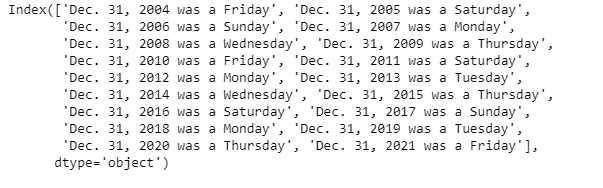
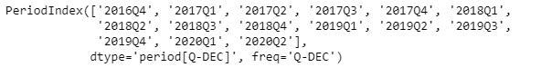
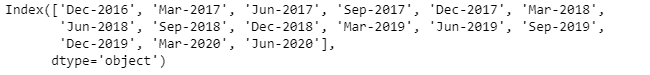

# Python | Pandas 周期指数. strftime

> 哎哎哎::1230【https://www . geeksforgeeks . org/python 熊猫周期索引-strftime/

Python 是进行数据分析的优秀语言，主要是因为以数据为中心的 python 包的奇妙生态系统。 ***【熊猫】*** 就是其中一个包，让导入和分析数据变得容易多了。

Pandas `**PeriodIndex.strftime()**`函数返回由 date_format 指定的格式化字符串数组，它支持与 python 标准库相同的字符串格式。

> **语法 ：** 句点索引.strftime（date_format）
> 
> **参数:**
> **date_format :** 日期格式字符串(如“%Y-%m-%d”)
> 
> **返回:**一系列格式化字符串

**示例#1:** 使用`PeriodIndex.strftime()`功能以指定的 date_format 打印给定的 PeriodIndex 对象。

```
# importing pandas as pd
import pandas as pd

# Create the PeriodIndex object
pidx = pd.PeriodIndex(start = '2004-11-11 02:45:21 ',
               end = '2021-5-21 8:45:29', freq = 'Y')

# Print the PeriodIndex object
print(pidx)
```

**输出:**


现在我们将使用`PeriodIndex.strftime()`函数以(' %b. %d，%Y 是%A ')格式返回每个周期元素。

```
# return the PeriodIndex in specified format
pidx.strftime('% b. % d, % Y was a % A')
```

]

**输出:**



正如我们在输出中看到的那样，`PeriodIndex.strftime()`函数返回了一个 Index 对象，该对象包含指定格式的给定 PeriodIndex 对象的每个元素。

**示例 2:** 使用`PeriodIndex.strftime()`功能以指定的 date_format 打印给定的 PeriodIndex 对象。

```
# importing pandas as pd
import pandas as pd

# Create the PeriodIndex object
pidx = pd.PeriodIndex(start = '2016-10-12 11:12:02', 
            end = '2020-04-12 11:32:12', freq = 'Q')

# Print the PeriodIndex object
print(pidx)
```

**输出:**



现在我们将使用`PeriodIndex.strftime()`函数以(' %b-%Y ')格式返回每个周期元素。

```
# return the PeriodIndex in specified format
pidx.strftime('% b-% Y')
```

]

**输出:**



正如我们在输出中看到的那样，`PeriodIndex.strftime()`函数返回了一个 Index 对象，该对象包含指定格式的给定 PeriodIndex 对象的每个元素。