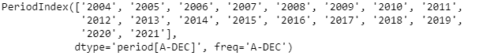
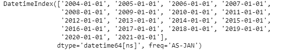
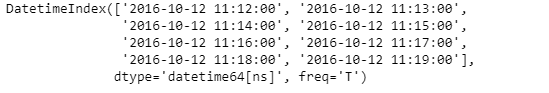

# Python | Pandas period index . to _ timestamp

> 原文:[https://www . geesforgeks . org/python-pandas-period index-to _ timestamp/](https://www.geeksforgeeks.org/python-pandas-periodindex-to_timestamp/)

Python 是进行数据分析的优秀语言，主要是因为以数据为中心的 python 包的奇妙生态系统。 ***【熊猫】*** 就是其中一个包，让导入和分析数据变得容易多了。

熊猫 `**PeriodIndex.to_timestamp()**`函数将给定的周期索引对象转换为日期时间索引对象。

> **语法:**period index . to _ timestamp(freq = None，how='start ')
> 
> **参数:**
> **freq :** 字符串或 DateOffset，默认' D '为一周或更长时间，' S'
> **how :** {'s '，' e '，' start '，' end'}
> 
> **返回 ：** 日期时间索引

**示例#1:** 使用`PeriodIndex.to_timestamp()`函数将给定的周期索引对象转换为日期时间索引。

```
# importing pandas as pd
import pandas as pd

# Create the PeriodIndex object
pidx = pd.PeriodIndex(start = '2004-11-11 02:45:21 ',
               end = '2021-5-21 8:45:29', freq = 'Y')

# Print the PeriodIndex object
print(pidx)
```

**输出:**



现在我们将使用`PeriodIndex.to_timestamp()`函数将给定的周期索引对象转换为日期时间索引对象。

```
# cast to DatetimeIndex object
pidx.to_timestamp()
```

]

**输出:**



正如我们在输出中看到的那样，`PeriodIndex.to_timestamp()`函数返回了一个 DatetimeIndex 对象。

**示例 2:** 使用`PeriodIndex.to_timestamp()`函数将给定的周期索引对象转换为日期时间索引。

```
# importing pandas as pd
import pandas as pd

# Create the PeriodIndex object
pidx = pd.PeriodIndex(start = '2016-10-12 11:12:02', 
            end = '2016-10-12 11:19:12', freq = 'T')

# Print the PeriodIndex object
print(pidx)
```

**输出:**


现在我们将使用`PeriodIndex.to_timestamp()`函数将给定的周期索引对象转换为日期时间索引对象。

```
# cast to DatetimeIndex object
pidx.to_timestamp()
```

]

**输出:**



正如我们在输出中看到的那样，`PeriodIndex.to_timestamp()`函数返回了一个 DatetimeIndex 对象。