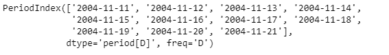
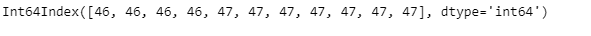
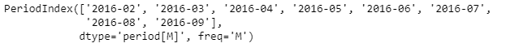
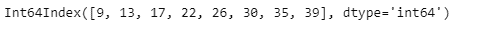

# 蟒蛇|熊猫 PeriodIndex.weekofyear

> 原文:[https://www . geesforgeks . org/python-pandas-period index-weekofyear/](https://www.geeksforgeeks.org/python-pandas-periodindex-weekofyear/)

Python 是进行数据分析的优秀语言，主要是因为以数据为中心的 python 包的奇妙生态系统。 ***【熊猫】*** 就是其中一个包，让导入和分析数据变得容易多了。

Pandas `**PeriodIndex.weekofyear**`属性返回一个 Index 对象，该对象包含给定 PeriodIndex 对象的每个周期元素的周序数值。

> **语法:** PeriodIndex.weekofyear
> 
> **参数:**无
> 
> **返回:**索引对象

**示例#1:** 使用`PeriodIndex.weekofyear`属性找出给定 PeriodIndex 对象中包含的每个 period 元素的周序数值。

```py
# importing pandas as pd
import pandas as pd

# Create the PeriodIndex object
pidx = pd.PeriodIndex(start ='2004-11-11 02:45:21 ',
               end ='2004-11-21 8:45:29', freq ='D')

# Print the PeriodIndex object
print(pidx)
```

**输出:**



现在我们将使用`PeriodIndex.weekofyear`属性找出给定 PeriodIndex 对象在一年中的周序数值。

```py
# return the week's ordinal value in the year
pidx.weekofyear
```

**输出:**



正如我们在输出中看到的那样，`PeriodIndex.weekofyear`属性返回了一个 Index 对象，该对象包含给定 PeriodIndex 对象中包含的每个 period 元素的周序数值。

**示例#2:** 使用`PeriodIndex.weekofyear`属性找出给定 PeriodIndex 对象中包含的每个 period 元素的周序数值。

```py
# importing pandas as pd
import pandas as pd

# Create the PeriodIndex object
pidx = pd.PeriodIndex(start ='2016-2-12 11:12:02',
            end ='2016-09-12 11:32:12', freq ='M')

# Print the PeriodIndex object
print(pidx)
```

**输出:**



现在我们将使用`PeriodIndex.weekofyear`属性找出给定 PeriodIndex 对象在一年中的周序数值。

```py
# return the week's ordinal value
pidx.weekofyear
```

**输出:**



正如我们在输出中看到的那样，`PeriodIndex.weekofyear`属性返回了一个 Index 对象，该对象包含给定 PeriodIndex 对象中包含的每个 period 元素的周序数值。