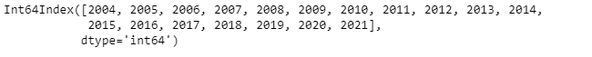
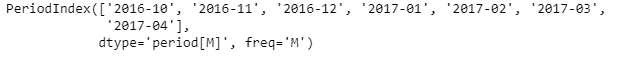
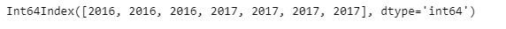

# 蟒蛇|熊猫 PeriodIndex.year

> 原文:[https://www . geesforgeks . org/python-pandas-period index-year/](https://www.geeksforgeeks.org/python-pandas-periodindex-year/)

Python 是进行数据分析的优秀语言，主要是因为以数据为中心的 python 包的奇妙生态系统。 ***【熊猫】*** 就是其中一个包，让导入和分析数据变得容易多了。

Pandas `**PeriodIndex.year**`属性返回一个 Index 对象，该对象包含给定 PeriodIndex 对象中每个周期元素的年份值。

> **语法:**周期索引.年份
> 
> **参数:**无
> 
> **返回:**索引对象

**示例#1:** 使用`PeriodIndex.year`属性找出给定周期索引对象中每个元素的周期年份。

```py
# importing pandas as pd
import pandas as pd

# Create the PeriodIndex object
pidx = pd.PeriodIndex(start ='2004-11-11 02:45:21 ',
                end ='2021-5-21 8:45:29', freq ='Y')

# Print the PeriodIndex object
print(pidx)
```

**输出:**


现在我们将使用`PeriodIndex.year`属性找出给定 PeriodIndex 对象中每个周期元素的年值。

```py
# return the year of each period
pidx.year
```

**输出:**


正如我们在输出中看到的那样，`PeriodIndex.year`属性已经返回了一个 Index 对象，该对象包含给定 PeriodIndex 对象中每个元素的期间年份。

**示例 2:** 使用`PeriodIndex.year`属性找出给定周期索引对象中每个元素的周期年份。

```py
# importing pandas as pd
import pandas as pd

# Create the PeriodIndex object
pidx = pd.PeriodIndex(start ='2016-10-12 11:12:02', 
             end ='2017-04-12 11:32:12', freq ='M')

# Print the PeriodIndex object
print(pidx)
```

**输出:**



现在我们将使用`PeriodIndex.year`属性找出给定 PeriodIndex 对象中每个周期元素的年值。

```py
# return the year of each period
pidx.year
```

**输出:**



正如我们在输出中看到的那样，`PeriodIndex.year`属性已经返回了一个 Index 对象，该对象包含给定 PeriodIndex 对象中每个元素的期间年份。