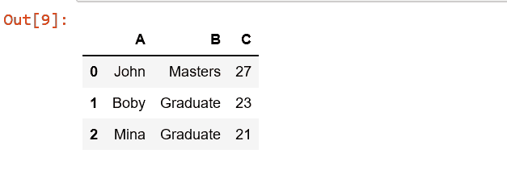
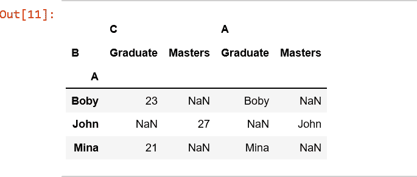

# Python | Pandas.pivot()

> 原文:[https://www.geeksforgeeks.org/python-pandas-pivot/](https://www.geeksforgeeks.org/python-pandas-pivot/)

**pandas.pivot(索引、列、值)**函数基于 DataFrame 的 3 列生成透视表。使用索引/列中的唯一值并用值填充。

> **参数:**
> **索引【ndarray】:**标签用于制作新框架的索引
> **列【ndarray】:**标签用于制作新框架的列
> **值【ndarray】:**值用于填充新框架的值
> 
> **返回:**重新整形的数据框
> **异常:**值如果有重复，将引发错误。

**代码:**

```py
# Create a simple dataframe

# importing pandas as pd
import pandas as pd

# creating a dataframe
df = pd.DataFrame({'A': ['John', 'Boby', 'Mina'],
      'B': ['Masters', 'Graduate', 'Graduate'],
      'C': [27, 23, 21]})

df
```



```py
# values can be an object or a list
df.pivot('A', 'B', 'C')
```


```py
# value is a list
df.pivot(index ='A', columns ='B', values =['C', 'A'])
```



提升值当有任何索引、列组合有多个值时出错。

```py
# importing pandas as pd
import pandas as pd

# creating a dataframe
df = pd.DataFrame({'A': ['John', 'John', 'Mina'],
      'B': ['Masters', 'Masters', 'Graduate'],
      'C': [27, 23, 21]})

df.pivot('A', 'B', 'C')
```

```py
ValueError: Index contains duplicate entries, cannot reshape
```