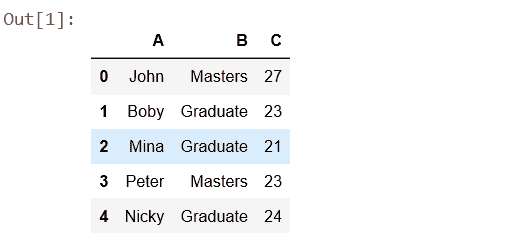
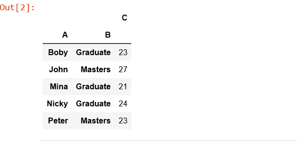
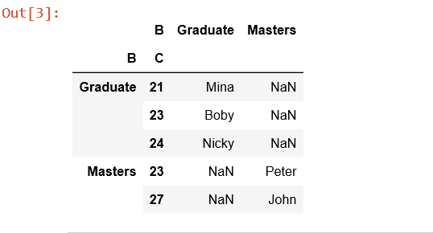

# Python | pandas . pivot _ table()

> 原文:[https://www.geeksforgeeks.org/python-pandas-pivot_table/](https://www.geeksforgeeks.org/python-pandas-pivot_table/)

**pandas.pivot_table(数据，值=无，索引=无，列=无，aggfunc='mean '，fill _ value =无，margins = False，dropna=True，margin _ name = ' All ')**创建一个电子表格样式的透视表作为数据框。

数据透视表中的级别将存储在结果数据框的索引和列上的多索引对象(分层索引)中。

> **`Parameters:`**
> 
> **数据:**数据框
> **值:**列要聚合，可选
> **索引:**列、石斑鱼、数组或列表的前一个
> **列:**列、石斑鱼、数组或列表的前一个
> 
> **aggfunc:** 函数，函数列表，dict，default numpy . mean
> **->**如果传递了函数列表，生成的透视表将有分层列，其顶层是函数名。
> **- >** 如果通过 dict，则键为要聚合的列，值为函数或函数列表
> 
> **fill _ Value[标量，默认无] :** 用
> **边距替换缺失值的值[布尔值，默认为假] :** 添加所有行/列(例如，用于小计/总计)
> **dropna[布尔值，默认为真] :** 不包括条目全部为 NaN 的列
> **边距 _ Name[字符串，默认为‘All’]:**当边距为真时将包含总计的行/列的名称。
> 
> **`Returns:`** DataFrame

代码:

```py
# Create a simple dataframe

# importing pandas as pd
import pandas as pd
import numpy as np

# creating a dataframe
df = pd.DataFrame({'A': ['John', 'Boby', 'Mina', 'Peter', 'Nicky'],
      'B': ['Masters', 'Graduate', 'Graduate', 'Masters', 'Graduate'],
      'C': [27, 23, 21, 23, 24]})

df
```



```py
# Simplest pivot table must have a dataframe
# and an index/list of index.
table = pd.pivot_table(df, index =['A', 'B'])

table
```



```py
# Creates a pivot table dataframe
table = pd.pivot_table(df, values ='A', index =['B', 'C'],
                         columns =['B'], aggfunc = np.sum)

table
```

