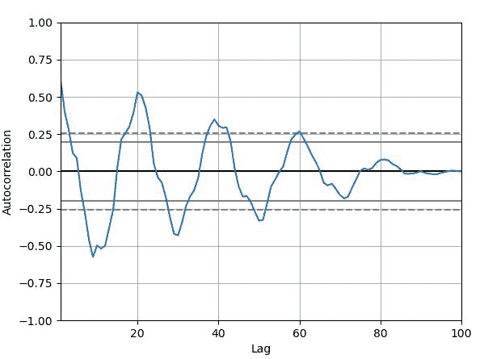
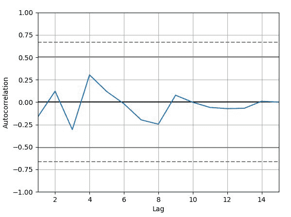

# 蟒蛇熊猫–绘制自相关图

> 原文:[https://www . geesforgeks . org/python-pandas-标绘-自相关-标绘/](https://www.geeksforgeeks.org/python-pandas-plotting-the-autocorrelation-plot/)

熊猫可以用来在图表上绘制**自相关图**。可以使用绘图模块的自相关绘图()方法在图形上绘制自相关绘图。该函数生成时间序列的自相关图。

## 自相关图

[**【自相关图】**](https://www.geeksforgeeks.org/autocorrelation-plot-using-matplotlib/) 是一种常用的检查数据集随机性的工具。这种随机性是通过计算不同时滞下数据值的自相关来确定的。它显示了一种称为时间序列的数据类型的属性。大多数通用统计软件程序中都有这些图。可以使用 pandas . ploting .自相关 _plot()来绘制。

> **语法:**pandas . ploting .自相关 _plot(series，ax=None，**kwargs)
> 
> **参数:**
> 
> *   **系列:**该参数是用于绘图的时间系列。
> *   **ax:** 该参数是 matplotlib axes 对象。其默认值为“无”。
> 
> **返回:**这个函数返回一个类的对象**matplotlip . axis**

**例 1:**

## 蟒蛇 3

```
# importing various package
import pandas as pd
import numpy as np
import matplotlib.pyplot as plt

# making Time series
spacing = np.linspace(-5 * np.pi, 5 * np.pi, num=100)
s = pd.Series(0.7 * np.random.rand(100) + 0.3 * np.sin(spacing))

# Creating Autocorrelation plot
x = pd.plotting.autocorrelation_plot(s)

# ploting the Curve
x.plot()

# Display
plt.show()
```

**输出:**



**例 2:**

## 蟒蛇 3

```
# importing various package
import pandas as pd
import numpy as np
import matplotlib.pyplot as plt

# making Time series
data = np.array([12.0, 24.0, 7., 20.0, 
                 7.0, 22.0, 18.0,22.0, 
                 6.0, 7.0, 20.0, 13.0, 
                 8.0, 5.0, 8])

# Creating Autocorrelation plot
x = pd.plotting.autocorrelation_plot(data)

# ploting the Curve
x.plot()

# Display
plt.show()
```

**输出:**

