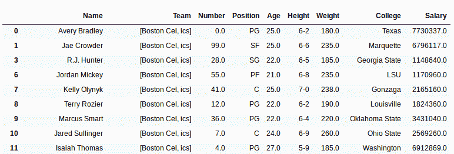
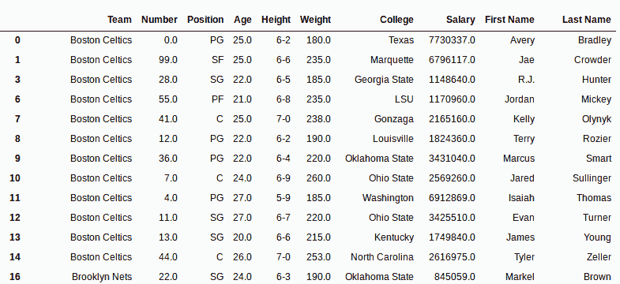

# Python | Pandas 使用 str.rsplit()

将字符串反向拆分为两个 List/Columns

> 原文:[https://www . geesforgeks . org/python-pandas-reverse-split-string-in-two-list-columns-use-str-rsplit/](https://www.geeksforgeeks.org/python-pandas-reverse-split-strings-into-two-list-columns-using-str-rsplit/)

Python 是进行数据分析的优秀语言，主要是因为以数据为中心的 Python 包的奇妙生态系统。 ***【熊猫】*** 就是其中一个包，让导入和分析数据变得容易多了。

Pandas 提供了一种方法来围绕传递的分隔符或定界符拆分字符串。之后，该字符串可以存储为序列中的列表，也可以用于从单个单独的字符串创建多列数据框。`rsplit()`的工作方式类似于`[.split()](https://www.geeksforgeeks.org/python-pandas-split-strings-into-two-list-columns-using-str-split/)`方法，但`rsplit()`从右侧开始分裂。当分隔符/定界符出现多次时，此功能也很有用。

***。str*** 在每次调用这个方法之前都必须加上前缀，以区别于 Python 的默认函数，否则会给出一个错误。

> **语法:**
> series . str . rsplit(pat = None，n=-1，expand=False)
> 
> **参数:**
> **pat:** 字符串值，分隔符或分隔字符串的分隔符在。
> **n:** 单个字符串中最大分色数，默认值为-1，表示全部。
> **展开:**布尔值，如果为真，则返回不同列中不同值的数据框。否则它会返回一个包含字符串列表的序列
> 
> **返回类型:**一系列列表或数据框，具体取决于展开参数

要下载使用的 Csv 文件，点击这里的[。](https://media.geeksforgeeks.org/wp-content/uploads/nba.csv)

在下面的例子中，使用的数据框包含了一些 NBA 球员的数据。任何操作前的数据框图像附在下面。


**例 1:** 从右侧将字符串拆分成列表

在本例中，“团队”列中的字符串在每次出现“t”时都会被拆分。n 参数保持为 1，因此同一字符串中的最大拆分数为 1。由于使用了 rsplit()，字符串将从右侧分开。

```
# importing pandas module 
import pandas as pd

# reading csv file from url 
data = pd.read_csv("https://media.geeksforgeeks.org/wp-content/uploads/nba.csv")

# dropping null value columns to avoid errors
data.dropna(inplace = True)

# new data frame with split value columns
data["Team"]= data["Team"].str.rsplit("t", n = 1, expand = False)

# display
data
```

**输出:**
如输出图像所示，字符串在“凯尔特人”的“t”处和“波士顿”的“t”处被拆分。这是因为分离是以相反的顺序发生的。由于 expand 参数保持为 False，因此返回了一个列表。


**示例#2:** 使用从字符串中创建单独的列。rsplit()

在本例中，“名称”列用空格(" ")分隔，expand 参数设置为 True，这意味着它将返回一个数据框，其中所有分隔的字符串都在不同的列中。然后使用数据框创建新列，并使用删除旧的名称列。drop()方法。

n 参数保持为 1，因为也可以有中间名(字符串中不止一个空格)。在这种情况下，rsplit()很有用，因为它从右侧计数，因此中间名字符串将包含在名字列中，因为最大分色数保持为 1。

```
# importing pandas module  
import pandas as pd 

# reading csv file from url  
data = pd.read_csv("https://media.geeksforgeeks.org/wp-content/uploads/nba.csv") 

# dropping null value columns to avoid errors 
data.dropna(inplace = True) 

# new data frame with split value columns 
new = data["Name"].str.split(" ", n = 1, expand = True) 

# making separate first name column from new data frame 
data["First Name"]= new[0] 

# making separate last name column from new data frame 
data["Last Name"]= new[1] 

# Dropping old Name columns 
data.drop(columns =["Name"], inplace = True) 

# df display 
data 
```

**输出:**
如输出图像所示，制作了两个新列，删除了旧的名称列。
