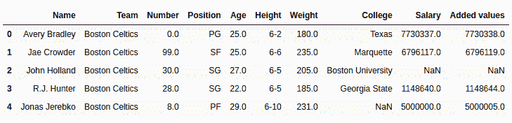
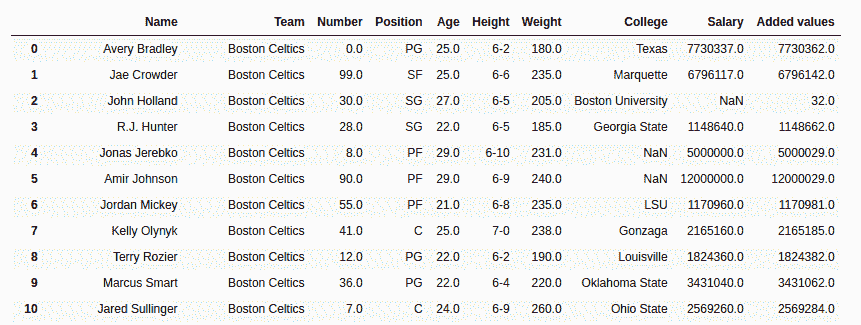

# 蟒蛇|熊猫系列. add()

> 原文:[https://www.geeksforgeeks.org/python-pandas-series-add/](https://www.geeksforgeeks.org/python-pandas-series-add/)

Python 是进行数据分析的优秀语言，主要是因为以数据为中心的 Python 包的奇妙生态系统。 ***【熊猫】*** 就是其中一个包，让导入和分析数据变得容易多了。

Python **`Series.add()`** 是用来给调用者系列添加系列或者列表一样长度的对象。

> **语法:**系列。添加(其他，级别=无，填充值=无，轴=0)
> 
> **参数:**
> **其他:**其他系列或列表类型添加到调用者系列
> **fill_value:** 添加
> **级别之前系列/列表中要用 NaN 替换的值:**多指标情况下级别的整数值
> 
> **返回类型:**添加了值的调用者系列

要下载下例使用的数据集，点击这里的[。](https://media.geeksforgeeks.org/wp-content/uploads/nba.csv)
在下面的例子中，使用的数据框包含了一些 NBA 球员的数据。任何操作前的数据框图像附在下面。


**示例#1:** 添加列表

在本例中，前 5 行使用存储在新变量中。head()方法。之后，创建一个相同长度的列表，并使用`.add()`方法将其添加到工资列中

```py
# importing pandas module 
import pandas as pd

# reading csv file from url 
data = pd.read_csv("https://media.geeksforgeeks.org/wp-content/uploads/nba.csv")

# creating short data of 5 rows
short_data = data.head()

# creating list with 5 values
list =[1, 2, 3, 4, 5]

# adding list data
# creating new column
short_data["Added values"]= short_data["Salary"].add(list)

# display
short_data
```

**输出:**
如输出图所示，可以对比出“附加值”栏是有“薪资”栏+列表的附加值。


**示例 2:** 将系列添加到具有空值的系列

在本例中，“年龄”列被添加到“薪资”列中。由于工资列也包含空值，默认情况下，无论添加什么，它都会返回 NaN。在本例中，传递 5 是为了用 5 替换空值。

```py
# importing pandas module 
import pandas as pd

# reading csv file from url 
data = pd.read_csv("https://media.geeksforgeeks.org/wp-content/uploads/nba.csv")

# age series
age = data["Age"]

# na replacement
na = 5

# adding values
# storing to new column
data["Added values"]= data["Salary"].add(other = age, fill_value = na)

# display
data
```

**输出:**
如输出图像所示，在“附加值”栏中添加了年龄栏，如果为空值，则为 5。
