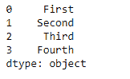
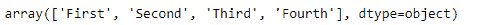
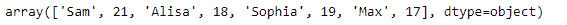

# 蟒蛇|熊猫系列作为主题

> 原文:[https://www . geesforgeks . org/python-pandas-series-a object/](https://www.geeksforgeeks.org/python-pandas-series-asobject/)

Python 是进行数据分析的优秀语言，主要是因为以数据为中心的 python 包的奇妙生态系统。 ***【熊猫】*** 就是其中一个包，让导入和分析数据变得容易多了。

熊猫 `**Series.asobject**`属性返回一个对象数据类型的数组。它将序列数据转换为对象类型的数组。

> **语法:** Series.asobject
> 
> **参数:**无
> 
> **返回:**对象数组

**示例#1:** 使用`Series.asobject`属性返回包含给定系列对象的装箱值的对象系列。

```py
# importing pandas as pd
import pandas as pd

# Creating the Series
sr = pd.Series(['First', 'Second', 'Third', 'Fourth'])

# Print the series
print(sr)
```

**输出:**



现在我们将使用`Series.asobject`属性将序列转换为对象类型的数组。

```py
# to return the series as object
sr.asobject
```

**输出:**


正如我们在输出中看到的，`Series.asobject`属性已经成功返回了一个对象数组。

**示例 2 :** 使用`Series.asobject`属性返回包含给定系列对象的装箱值的对象系列。

```py
# importing pandas as pd
import pandas as pd

# Creating the Series
sr = pd.Series(['Sam', 21, 'Alisa', 18, 'Sophia', 19, 'Max', 17])

# Print the series
print(sr)
```

**输出:**


现在我们将使用`Series.asobject`属性将序列转换为对象类型的数组。

```py
# to return the series as object
sr.asobject
```

**输出:**



正如我们在输出中看到的那样，`Series.asobject`属性已经成功返回了一个对象数组。