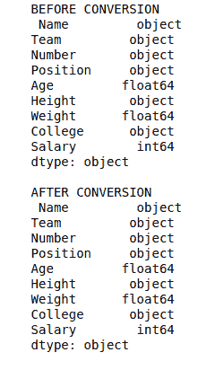

# Python | Pandas series . a type()转换系列的数据类型

> 原文:[https://www . geesforgeks . org/python-pandas-series-as type-to-convert-data-type-of-series/](https://www.geeksforgeeks.org/python-pandas-series-astype-to-convert-data-type-of-series/)

Python 是进行数据分析的优秀语言，主要是因为以数据为中心的 Python 包的奇妙生态系统。 ***【熊猫】*** 就是其中一个包，让导入和分析数据变得容易多了。

熊猫 **`astype()`** 是最重要的方法之一。它用于更改序列的数据类型。当数据框由 csv 文件构成时，会导入列，并自动设置数据类型，这种设置很多时候并不是它实际应该有的。例如，工资列可以作为字符串导入，但是要执行操作，我们必须将它转换为浮点数。
**`astype()`** 就是用来做这样的数据类型转换的。

> **语法:** DataFrame.astype(数据类型，复制=真，错误= '提升')
> 
> **参数:**
> **数据类型:**数据类型要转换成的序列。(例如 str、float、int)
> **复制:**制作数据框/系列的[副本。
> **错误:**转换为无效数据类型时出错。例如 dict to string。“引发”将引发错误,“忽略”将在不引发错误的情况下通过。](https://www.geeksforgeeks.org/python-difference-between-pandas-copy-and-copying-through-variables/)
> 
> **返回类型:**数据类型发生变化的系列

要下载下例使用的数据集，点击这里的[。](https://media.geeksforgeeks.org/wp-content/uploads/nba.csv)
在下面的例子中，使用的数据框包含了一些 NBA 球员的数据。任何操作前的数据框图像附在下面。


**示例:**
在本例中，数据框被导入并。在数据框中调用 dtypes 来查看系列的数据类型。之后，一些列使用。再次查看 astype()方法和数据类型以查看更改。

```py
# importing pandas module 
import pandas as pd

# reading csv file from url 
data = pd.read_csv("https://media.geeksforgeeks.org/wp-content/uploads/nba.csv")

# dropping null value columns to avoid errors
data.dropna(inplace = True)

# storing dtype before converting
before = data.dtypes

# converting dtypes using astype
data["Salary"]= data["Salary"].astype(int)
data["Number"]= data["Number"].astype(str)

# storing dtype after converting
after = data.dtypes

# printing to compare
print("BEFORE CONVERSION\n", before, "\n")
print("AFTER CONVERSION\n", after, "\n")
```

**输出:**
如输出图像所示，列的数据类型进行了相应的转换。
