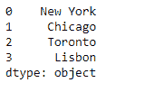
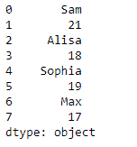
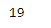

# 蟒蛇|熊猫系列

> 原文:[https://www.geeksforgeeks.org/python-pandas-series-at/](https://www.geeksforgeeks.org/python-pandas-series-at/)

Python 是进行数据分析的优秀语言，主要是因为以数据为中心的 python 包的奇妙生态系统。 ***【熊猫】*** 就是其中一个包，让导入和分析数据变得容易多了。

Pandas `**Series.at**`属性使我们能够访问行/列标签对的单个值。该属性与`loc`相似，都提供基于标签的查找。

> **语法:**系列
> 
> **参数:**无
> 
> **返回:**单值

**示例#1:** 使用`Series.at`属性访问给定序列对象中任何特定位置的单个值。

```py
# importing pandas as pd
import pandas as pd

# Creating the Series
sr = pd.Series(['New York', 'Chicago', 'Toronto', 'Lisbon'])

# Print the series
print(sr)
```

**输出:**



现在我们将使用`Series.at`属性返回 Series 对象中给定索引处的元素。

```py
# return the element at the first position
sr.at[1]
```

**输出:**

正如我们在输出中看到的，`Series.at`属性返回了“Chicago”，因为这是位于给定 Series 对象中第一个位置的值。

**示例#2 :** 使用`Series.at`属性访问给定序列对象中任何特定位置的单个值。

```py
# importing pandas as pd
import pandas as pd

# Creating the Series
sr = pd.Series(['Sam', 21, 'Alisa', 18, 'Sophia', 19, 'Max', 17])

# Print the series
print(sr)
```

**输出:**



现在我们将使用`Series.at`属性返回 Series 对象中给定索引处的元素。

```py
# return the element at the first position
sr.at[5]
```

**输出:**


正如我们在输出中看到的，`Series.at`属性返回了‘19’，因为这是位于给定序列对象中第 5 个位置的值。