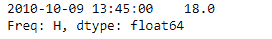
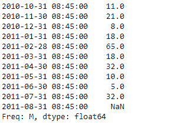

# 蟒蛇|熊猫系列. at_time()

> 原文:[https://www.geeksforgeeks.org/python-pandas-series-at_time/](https://www.geeksforgeeks.org/python-pandas-series-at_time/)

熊猫系列是带有轴标签的一维数组。标签不必是唯一的，但必须是可散列的类型。该对象支持基于整数和基于标签的索引，并提供了一系列方法来执行涉及索引的操作。

熊猫 `**Series.at_time()**`功能用于选择给定系列对象中一天中特定时间(例如上午 9:30)的值。

> **语法:** Series.at_time(时间，asof=False，轴=无)
> 
> **参数:**
> **时间:** datetime.time 或 string
> **轴:** {0 或' index '，1 或' columns'}，默认为 0
> 
> **返回:**值 _at_time:与调用者类型相同

**示例#1:** 使用`Series.at_time()`函数返回给定系列对象中一天中特定时间的值。

```
# importing pandas as pd
import pandas as pd

# Creating the Series
sr = pd.Series([11, 21, 8, 18, 65, 18, 32, 10, 5, 32, None])

# Create the Index
index_ = pd.date_range('2010-10-09 08:45', periods = 11, freq ='H')

# set the index
sr.index = index_

# Print the series
print(sr)
```

**输出:**


现在我们将使用`Series.at_time()`函数返回给定序列对象中一天中特定时间的值。

```
# return values at particular time of the day
result = sr.at_time(time = '13:45:00')

# Print the result
print(result)
```

**输出:**


正如我们在输出中看到的那样，`Series.at_time()`函数已经成功地返回了给定序列对象中一天中特定时间的值。

**示例 2 :** 使用`Series.at_time()`函数返回给定系列对象中一天中特定时间的值。

```
# importing pandas as pd
import pandas as pd

# Creating the Series
sr = pd.Series([11, 21, 8, 18, 65, 18, 32, 10, 5, 32, None])

# Create the Index
# apply monthly frequency
index_ = pd.date_range('2010-10-09 08:45', periods = 11, freq ='M')

# set the index
sr.index = index_

# Print the series
print(sr)
```

**输出:**


现在我们将使用`Series.at_time()`函数返回给定序列对象中一天中特定时间的值。

```
# return values at particular time of the day
result = sr.at_time(time = '08:45:00')

# Print the result
print(result)
```

**输出:**


正如我们在输出中看到的，`Series.at_time()`函数已经成功地返回了给定序列对象中一天中特定时间的值。序列对象中的所有值都已返回，因为它们的时间值等于经过的时间。