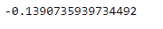
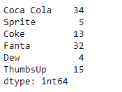
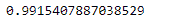

# Python | Pandas series . auto corr()

> 原文:[https://www . geesforgeks . org/python-pandas-series-auto corr/](https://www.geeksforgeeks.org/python-pandas-series-autocorr/)

熊猫系列是带有轴标签的一维数组。标签不必是唯一的，但必须是可散列的类型。该对象支持基于整数和基于标签的索引，并提供了一系列方法来执行涉及索引的操作。

熊猫 `**Series.autocorr()**`函数计算滞后-N 自相关。这种方法计算数列与其移位自身之间的皮尔逊相关。

> **语法:** Series.autocorr(lag=1)
> 
> **参数:**
> **滞后:**执行自相关前应用的滞后数。
> 
> **返回:**浮动

**示例#1:** 使用`Series.autocorr()`函数计算给定序列对象的基础数据的滞后-N 自相关。

```py
# importing pandas as pd
import pandas as pd

# Creating the Series
sr = pd.Series([11, 21, 8, 18, 65, 18, 32, 10, 5, 32, None])

# Create the Index
index_ = pd.date_range('2010-10-09 08:45', periods = 11, freq ='H')

# set the index
sr.index = index_

# Print the series
print(sr)
```

**输出:**

现在我们将使用`Series.autocorr()`函数来计算给定序列对象的底层数据的 lag-n 自相关。

```py
# return the auto correlation
result = sr.autocorr()

# Print the result
print(result)
```

**输出:**



正如我们在输出中看到的，`Series.autocorr()`函数已经成功地通过 lag 1 返回了给定序列对象的底层数据的自相关。

**示例 2 :** 使用`Series.autocorr()`函数计算给定序列对象的基础数据的滞后-N 自相关。取滞后值等于 3。

```py
# importing pandas as pd
import pandas as pd

# Creating the Series
sr = pd.Series([34, 5, 13, 32, 4, 15])

# Create the Index
index_ = ['Coca Cola', 'Sprite', 'Coke', 'Fanta', 'Dew', 'ThumbsUp']

# set the index
sr.index = index_

# Print the series
print(sr)
```

**输出:**


现在我们将使用`Series.autocorr()`函数来计算给定序列对象的底层数据的滞后 n 自相关。

```py
# return the auto correlation
# by lag-3
result = sr.autocorr(lag = 3)

# Print the result
print(result)
```

**输出:**


正如我们在输出中看到的，`Series.autocorr()`函数已经成功地通过 lag 1 返回了给定序列对象的底层数据的自相关。