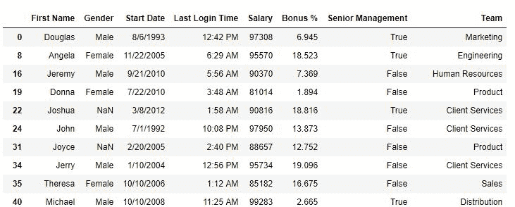

# 蟒蛇|熊猫系列.介于()

> 原文:[https://www.geeksforgeeks.org/python-pandas-series-between/](https://www.geeksforgeeks.org/python-pandas-series-between/)

Python 是进行数据分析的优秀语言，主要是因为以数据为中心的 python 包的奇妙生态系统。 ***【熊猫】*** 就是其中一个包，让导入和分析数据变得容易多了。

熊猫 ***介于()*** 方法用于系列检查第一个和第二个参数之间的值。

> **语法:**系列。介于(左、右、含=真)
> 
> **参数:**
> 
> **左:**定义左边界的标量值
> **右:**定义右边界的标量值
> **包括:**默认为真的布尔值。如果为 False，它将在检查时排除两个传递的参数。

**返回类型:**一个布尔序列，对于位于参数值之间的每个元素都为真。

要下载使用的 CSV 文件，点击这里[。](https://media.geeksforgeeks.org/wp-content/uploads/employees.csv)

**示例#1:** 检查薪资列的值。如果它们介于 80000 和 100000 之间，则返回 True。

```py
# importing pandas package
import pandas as pd

# making data frame from csv file
data = pd.read_csv("employees.csv")

# making a bool series
bool_series = data["Salary"].between(80000, 100000, inclusive = True)

# returning dataframe with salary between above values
data[bool_series]
```

**输出:**
如输出图像所示，数据框中只有工资在 8 万到 10 万之间的行。



**错误和异常:**

*   此方法不适用于字符串。
*   此方法仅适用于系列(1D 数据帧)