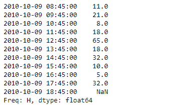
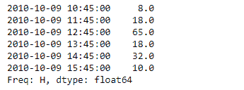
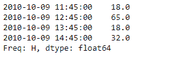

# 蟒蛇|熊猫系列. between_time()

> 原文:[https://www . geesforgeks . org/python-pandas-series-between _ time/](https://www.geeksforgeeks.org/python-pandas-series-between_time/)

熊猫系列是带有轴标签的一维数组。标签不必是唯一的，但必须是可散列的类型。该对象支持基于整数和基于标签的索引，并提供了一系列方法来执行涉及索引的操作。

熊猫 `**Series.between_time()**`功能选择一天中特定时间(如上午 9:00-9:30)之间的数值。通过将 start_time 设置为晚于 end_time，可以获得不在这两个时间之间的时间。

> **语法:**序列。介于 _ 时间(开始 _ 时间，结束 _ 时间，包含 _ 开始=真，包含 _ 结束=真，轴=无)
> 
> **参数:**
> **开始 _ 时间:**日期时间或字符串
> **结束 _ 时间:**日期时间或字符串
> **包含 _ 开始:**布尔值，默认真
> **包含 _ 结束:**布尔值，默认真
> **轴:** {0 或‘索引’，1 或‘列’}，默认 0
> 
> **返回:**值 _ 介于 _ 时间:与调用者类型相同

**示例#1:** 使用`Series.between_time()`函数返回给定持续时间内的值。

```
# importing pandas as pd
import pandas as pd

# Creating the Series
sr = pd.Series([11, 21, 8, 18, 65, 18, 32, 10, 5, 32, None])

# Create the Index
index_ = pd.date_range('2010-10-09 08:45', periods = 11, freq ='H')

# set the index
sr.index = index_

# Print the series
print(sr)
```

**输出:**


现在我们将使用`Series.between_time()`函数返回给定持续时间内的值。

```
# return values between the passed time duration
result = sr.between_time(start_time = '10:45', end_time = '15:45')

# Print the result
print(result)
```

**输出:**

正如我们在输出中看到的，`Series.between_time()`函数已经成功地返回了给定持续时间内的值。

**示例 2 :** 使用`Series.between_time()`函数返回给定持续时间内的值。跳过对应于开始和结束时间的值。

```
# importing pandas as pd
import pandas as pd

# Creating the Series
sr = pd.Series([11, 21, 8, 18, 65, 18, 32, 10, 5, 32, None])

# Create the Index
index_ = pd.date_range('2010-10-09 08:45', periods = 11, freq ='H')

# set the index
sr.index = index_

# Print the series
print(sr)
```

**输出:**


现在我们将使用`Series.between_time()`函数返回给定持续时间内的值。跳过对应于开始和结束时间的值。

```
# return values between the passed time duration
# skip the start and end time
result = sr.between_time(start_time = '10:45', end_time = '15:45',
                       include_start = False, include_end = False)

# Print the result
print(result)
```

**输出:**

正如我们在输出中看到的，`Series.between_time()`函数已经成功地返回了给定持续时间内的值。请注意，对应于开始和结束时间的值未包括在内。