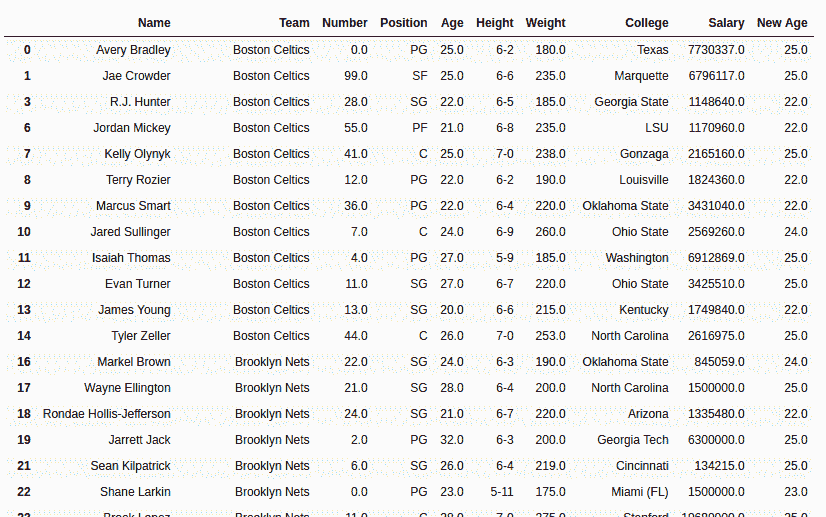

# 蟒蛇|熊猫系列. clip()

> 原文:[https://www.geeksforgeeks.org/python-pandas-series-clip/](https://www.geeksforgeeks.org/python-pandas-series-clip/)

Python 是进行数据分析的优秀语言，主要是因为以数据为中心的 Python 包的奇妙生态系统。 ***【熊猫】*** 就是其中一个包，让导入和分析数据变得容易多了。

Python **`Series.clip()`** 用于将低于和高于的值裁剪为通过的最小值和最大值。这种方法在进行信号处理等操作时会用到。众所周知，数字信号只有两个值，高或低。熊猫`Series.clip()` 可用于将数值限制在特定范围内。

> **语法:**系列.剪辑(下=无，上=无，轴=无，在位=假)
> 
> **参数:**
> **下限:**设置范围的最小值。低于此值的任何值都等于较低值。
> **上限:**设置范围的最大值。高于此值的任何值都等于上限。
> **轴:** 0 或“索引”按行应用方法，1 或“列”按列应用
> **在位置:**对调用者系列本身进行更改。(用新值覆盖)
> 
> **返回类型:**具有更新值的系列

要下载下例使用的数据集，点击这里的[。](https://media.geeksforgeeks.org/wp-content/uploads/nba.csv)
在下面的例子中，使用的数据框包含了一些 NBA 球员的数据。任何操作前的数据框图像附在下面。


**示例**
在此示例中，`.clip()` 方法在数据的年龄列上调用。最小值 22 传递给下参数，25 传递给上参数。然后，返回的系列存储在新的列“新时代”中。在执行任何操作之前，使用`.dropna()`删除空行以避免错误。

```
# importing pandas module 
import pandas as pd 

# importing regex module
import re

# making data frame 
data = pd.read_csv("https://media.geeksforgeeks.org/wp-content/uploads/nba.csv") 

# removing null values to avoid errors 
data.dropna(inplace = True) 

# lower value of range
lower = 22

# upper value of range
upper = 25

# passing values to new column
data["New Age"]= data["Age"].clip(lower = lower, upper = upper)

# display
data
```

**输出:**
如输出图像所示，“新时代”列的最小值为 22，最大值为 25。所有值都限制在此范围内。低于 22 的值等于 22，高于 25 的值等于 25。
