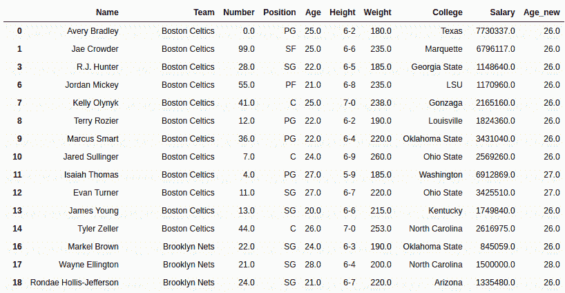
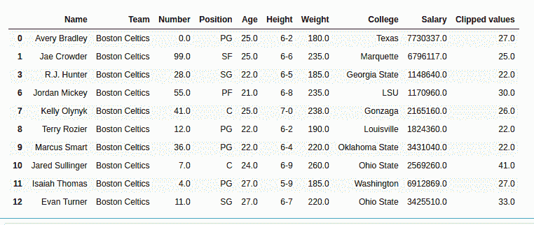

# 蟒蛇|熊猫系列. clip _ low()

> 原文:[https://www . geesforgeks . org/python-pandas-series-clip _ low/](https://www.geeksforgeeks.org/python-pandas-series-clip_lower/)

Python 是进行数据分析的优秀语言，主要是因为以数据为中心的 Python 包的奇妙生态系统。 ***【熊猫】*** 就是其中一个包，让导入和分析数据变得容易多了。
熊猫**系列. clip_lower()** 用于将值裁剪到通过的最小值以下。阈值作为参数传递，并且系列中小于阈值的所有值都等于该阈值。

> **语法:** Series.clip_lower(threshold，axis=None，inplace=False)
> **参数:**
> **threshold:** 类似数字或列表，设置最小阈值，如果是列表，则为调用者系列中的每个值设置单独的阈值(给定列表大小相同)
> **axis:** 0 或“index”按行应用方法，1 或“columns”按列应用方法
> **inplace:** 进行更改(用新值覆盖)
> **返回类型:**系列更新值

要下载下例使用的数据集，点击这里的[。](https://media.geeksforgeeks.org/wp-content/uploads/nba.csv)
在下面的例子中，使用的数据框包含了一些 NBA 球员的数据。任何操作前的数据框图像附在下面。


**示例#1** :应用于单值序列
在此示例中，最小阈值 26 作为参数传递给。clip _ lower()方法。此方法在数据框的“年龄”列上调用，新值存储在“年龄 _ 新”列中。在执行任何操作之前，使用。dropna()

## 蟒蛇 3

```
# importing pandas module
import pandas as pd

# making data frame
data = pd.read_csv("https://media.geeksforgeeks.org/wp-content/uploads/nba.csv")

# removing null values to avoid errors
data.dropna(inplace = True)

# setting threshold value
threshold = 26.0

# applying method and passing to new column
data["Age_new"]= data["Age"].clip_lower(threshold)

# display
data
```

**输出:**
如输出图像所示，Age_new 列的最小值为 26。所有小于 26 的值都增加到 26，并存储在新列中。



**示例#2:** 应用于具有列表类型值的系列
在此示例中，年龄列的前 10 行使用提取和存储。head()方法。之后，创建一个相同长度的列表，并将其传递给阈值参数。clip_lower()方法为系列中的每个值设置单独的阈值。返回值存储在新列“clipped_values”中。

## 蟒蛇 3

```
# importing pandas module
import pandas as pd

# importing regex module
import re

# making data frame
data = pd.read_csv("https://media.geeksforgeeks.org/wp-content/uploads/nba.csv")

# removing null values to avoid errors
data.dropna(inplace = True)

# returning top rows
new_data = data.head(10).copy()

# list for separate threshold values
threshold =[27, 23, 19, 30, 26, 22, 22, 41, 11, 33]

# applying method and returning to new column
new_data["Clipped values"]= new_data["Age"].clip_lower(threshold = threshold)

# display
new_data
```

**输出:**
如输出图像所示，根据传递的列表，序列中的每个值都有不同的阈值，因此根据每个元素的单独阈值返回结果。

