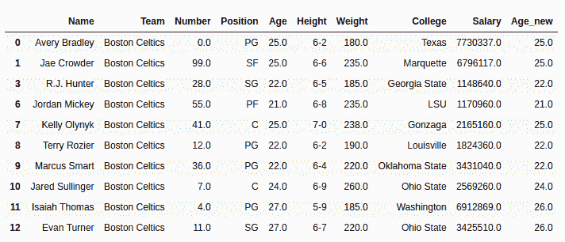
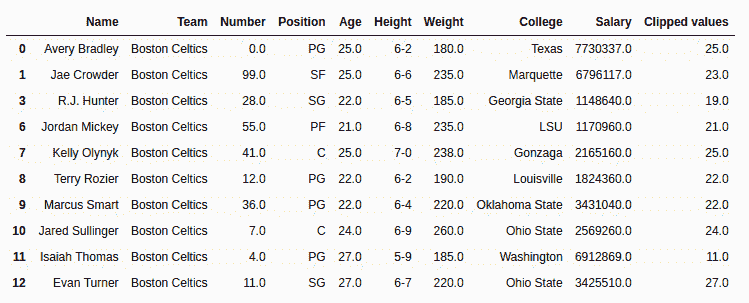

# 蟒蛇|熊猫系列. clip_upper()

> 原文:[https://www . geesforgeks . org/python-pandas-series-clip _ upper/](https://www.geeksforgeeks.org/python-pandas-series-clip_upper/)

Python 是进行数据分析的优秀语言，主要是因为以数据为中心的 Python 包的奇妙生态系统。 ***【熊猫】*** 就是其中一个包，让导入和分析数据变得容易多了。

熊猫 **`Series.clip_upper()`** 用于将值剪切到超过传递的最大值。阈值作为参数传递，所有大于阈值的串联值都等于阈值。

> **语法:** Series.clip_upper(阈值，轴=无，在位=假)
> 
> **参数:**
> **阈值:**类似数值或列表，设置最大阈值，如果是列表，为调用者系列中的每个值设置单独的阈值(给定列表大小相同)
> **轴:** 0 或“索引”按行应用方法，1 或“列”按列应用方法。
> **在位:**对调用者系列本身进行修改。(用新值覆盖)
> 
> **返回类型:**具有更新值的系列

要下载下例使用的数据集，点击这里的[。](https://media.geeksforgeeks.org/wp-content/uploads/nba.csv)
在下面的例子中，使用的数据框包含了一些 NBA 球员的数据。任何操作前的数据框图像附在下面。


**示例#1** :应用于单值序列
在此示例中，最大阈值 26 作为参数传递给。clip_upper()方法。此方法在数据框的“年龄”列上调用，新值存储在“年龄 _ 新”列中。在执行任何操作之前，使用。dropna()

## 蟒蛇 3

```
# importing pandas module 
import pandas as pd 

# making data frame 
data = pd.read_csv("https://media.geeksforgeeks.org/wp-content/uploads/nba.csv") 

# removing null values to avoid errors 
data.dropna(inplace = True) 

# setting threshold value
threshold = 26.0

# applying method and passing to new column
data["Age_new"]= data["Age"].clip_upper(threshold)

# displaying top 10 rows
data.head(10)
```

**输出:**
如输出图像所示，Age_new 列的最大值为 26。所有大于 26 的值都被剪裁并等于 26。


**示例 2:** 应用于具有列表类型值的系列

在本例中，年龄列的前 10 行使用`.head()` 方法提取并存储。之后，创建一个相同长度的列表，并将其传递给`.clip_upper()` 方法的阈值参数，为串联的每个值设置单独的阈值。返回值存储在新列“clipped_values”中。

## 蟒蛇 3

```
# importing pandas module 
import pandas as pd 

# importing regex module
import re

# making data frame 
data = pd.read_csv("https://media.geeksforgeeks.org /wp-content/uploads/nba.csv") 

# removing null values to avoid errors 
data.dropna(inplace = True) 

# returning top rows
new_data = data.head(10).copy()

# list for separate threshold values
threshold =[27, 23, 19, 30, 26, 22, 22, 41, 11, 33]

# applying method and returning to new column
new_data["Clipped values"]= new_data["Age"].clip_upper(threshold = threshold)

# display
new_data
```

**输出:**
如输出图像所示，根据传递的列表，序列中的每个值都有不同的阈值，因此根据每个元素的单独阈值返回结果。超过各自阈值的所有值都被削减到阈值。
