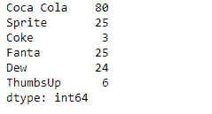
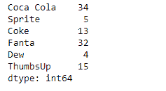
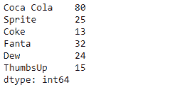
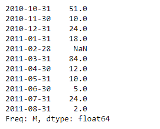
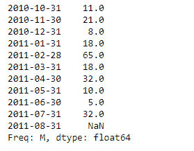
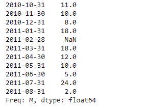

# 蟒蛇|熊猫系列. combine()

> 原文:[https://www . geesforgeks . org/python-pandas-series-combine-2/](https://www.geeksforgeeks.org/python-pandas-series-combine-2/)

熊猫系列是带有轴标签的一维数组。标签不必是唯一的，但必须是可散列的类型。该对象支持基于整数和基于标签的索引，并提供了一系列方法来执行涉及索引的操作。

熊猫 `**Series.combine()**`函数根据函数将级数与级数或标量相结合。它结合了系列和其他使用功能，为组合系列执行元素选择。当正在组合的两个对象之一的某个索引处缺少值时，将假定 fill_value。

> **语法:**系列。组合(其他，函数，fill _ value =无)
> 
> **参数:**
> **其他:**级数或标量
> **函数:**以两个标量为输入并返回一个元素的函数。
> **fill_value :** 当一个系列或另一个系列缺少索引时要采用的值。
> 
> **返回:**系列

**示例#1:** 使用`Series.combine()`函数查找两个系列对象中每个索引标签的最大值。

```
# importing pandas as pd
import pandas as pd

# Creating the first Series
sr1 = pd.Series([80, 25, 3, 25, 24, 6])

# Creating the second Series
sr2 = pd.Series([34, 5, 13, 32, 4, 15])

# Create the Index
index_ = ['Coca Cola', 'Sprite', 'Coke', 'Fanta', 'Dew', 'ThumbsUp']

# set the first index
sr1.index = index_

# set the second index
sr2.index = index_

# Print the first series
print(sr1)

# Print the second series
print(sr2)
```

**输出:**


现在我们将使用`Series.combine()`函数来查找两个给定序列对象中每个索引标签的最大值。

```
# find the maximum element-wise
# among sr1 and sr2
result = sr1.combine(other = sr2, func = max)

# Print the result
print(result)
```

**输出:**

正如我们在输出中看到的，`Series.combine()`函数已经成功地返回了两个系列对象中每个索引标签的最大值。

**示例#2 :** 使用`Series.combine()`函数查找两个系列对象中每个索引标签的最小值。

```
# importing pandas as pd
import pandas as pd

# Creating the first Series
sr1 = pd.Series([51, 10, 24, 18, None, 84, 12, 10, 5, 24, 2])

# Creating the second Series
sr2 = pd.Series([11, 21, 8, 18, 65, 18, 32, 10, 5, 32, None])

# Create the Index
index_ = pd.date_range('2010-10-09', periods = 11, freq ='M')

# set the first index
sr1.index = index_

# set the second index
sr2.index = index_

# Print the first series
print(sr1)

# Print the second series
print(sr2)
```

**输出:**


现在我们将使用`Series.combine()`函数来查找两个给定序列对象中每个索引标签的最小值。

```
# find the minimum element-wise
# among sr1 and sr2
result = sr1.combine(other = sr2, func = min)

# Print the result
print(result)
```

**输出:**


从输出中我们可以看到，`Series.combine()`函数已经成功返回了两个系列对象中每个索引标签的最小值。