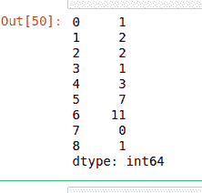

# 蟒蛇|熊猫系列. combine()

> 原文:[https://www.geeksforgeeks.org/python-pandas-series-combine/](https://www.geeksforgeeks.org/python-pandas-series-combine/)

Python 是进行数据分析的优秀语言，主要是因为以数据为中心的 Python 包的奇妙生态系统。 ***【熊猫】*** 就是其中一个包，让导入和分析数据变得容易多了。

熊猫 **`Series.combine()`** 是一系列数学运算方法。这用于将两个系列组合成一个系列。输出系列的形状与调用者系列相同。元素由作为参数传递给`combine()`方法的函数决定。两个系列的形状必须相同，否则会产生错误。

> **语法:** Series.combine(other，func，fill_value=nan)
> 
> **参数:**
> **其他:**要与调用者系列
> **组合的其他系列或列表类型功能:**作为参数传递的函数，该函数将决定元素应该从哪个系列放在该索引处
> **fill_value:** 多索引情况下的级别整数值
> 
> **返回:**与来电者系列形状相同的组合系列

**示例#1:**

在本例中，使用制作了两个列表，并将其转换为熊猫系列。Series()方法。使用 lambda 创建一个函数，该函数检查两个序列中哪些值较小，并返回较小的值。

```py
# importing pandas module
import pandas as pd

# creating first series
first =[1, 2, 5, 6, 3, 7, 11, 0, 4]

# creating second series
second =[5, 3, 2, 1, 3, 9, 21, 3, 1]

# making series
first = pd.Series(first)

# making seriesa
second = pd.Series(second)

# calling .combine() method
result = first.combine(second, (lambda x1, x2: x1 if x1 < x2 else x2))

# display
result
```

**输出:**
如输出图像所示，返回的序列具有来自两个序列的较小值。


**例 2:**

在本例中，也使用`Numpy.nan`方法传递空值。由于序列包含空值，所以将 5 传递给 fill_value 参数，用 5 替换空值。传递一个 lambda 函数，该函数将比较两个序列中的值，并将返回较大的一个。

```py
# importing pandas module
import pandas as pd

# importing numpy module
import numpy as np

# creating first series
first =[1, 2, np.nan, 5, 6, 3, np.nan, 7, 11, 0, 4, 8]

# creating second series
second =[5, 3, 2, np.nan, 1, 3, 9, 21, 3, np.nan, 1, np.nan]

# making series
first = pd.Series(first)

# making seriesa
second = pd.Series(second)

# calling .combine() method
result = first.combine(second, func =(lambda x1, x2: x1 if x1 > x2 else x2), fill_value = 5)

# display
result
```

**输出:**
如输出所示，在组合序列之前，序列中的 NaN 值被替换为 5。

```py

0      5.0
1      3.0
2      2.0
3      5.0
4      6.0
5      3.0
6      9.0
7     21.0
8     11.0
9      5.0
10     4.0
11     8.0
dtype: float64
```