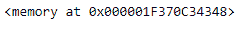
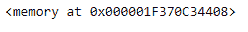

# Python |熊猫系列.数据

> 原文:[https://www.geeksforgeeks.org/python-pandas-series-data/](https://www.geeksforgeeks.org/python-pandas-series-data/)

Python 是进行数据分析的优秀语言，主要是因为以数据为中心的 python 包的奇妙生态系统。 ***【熊猫】*** 就是其中一个包，让导入和分析数据变得容易多了。

熊猫系列是带有轴标签的一维数组。标签不必是唯一的，但必须是可散列的类型。该对象支持基于整数和基于标签的索引，并提供了一系列方法来执行涉及索引的操作。

Pandas `**Series.data**`属性返回给定序列对象的基础数据的数据指针。

> **语法:**系列.数据
> 
> **参数:**无
> 
> **返回:**数据指针

**示例#1:** 使用`Series.data`属性查找给定 Series 对象的数据指针。

```
# importing pandas as pd
import pandas as pd

# Creating the Series
sr = pd.Series(['New York', 'Chicago', 'Toronto', 'Lisbon'])

# Creating the row axis labels
sr.index = ['City 1', 'City 2', 'City 3', 'City 4'] 

# Print the series
print(sr)
```

**输出:**


现在我们将使用`Series.data`属性返回给定 Series 对象的数据指针。

```
# return the data pointer
sr.data
```

**输出:**

正如我们在输出中看到的，`Series.data`属性已经返回了给定 Series 对象的数据指针。它是存储对象的位置。

**例 2 :** 使用`Series.data`属性查找给定 Series 对象的数据指针。

```
# importing pandas as pd
import pandas as pd

# Creating the Series
sr = pd.Series(['1/1/2018', '2/1/2018', '3/1/2018', '4/1/2018'])

# Creating the row axis labels
sr.index = ['Day 1', 'Day 2', 'Day 3', 'Day 4']

# Print the series
print(sr)
```

**输出:**


现在我们将使用`Series.data`属性返回给定 Series 对象的数据指针。

```
# return the data pointer
sr.data
```

**输出:**

正如我们在输出中看到的，`Series.data`属性已经返回了给定 Series 对象的数据指针。它是存储对象的位置。