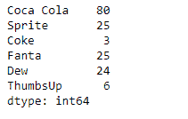
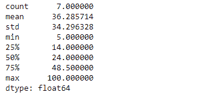

# 蟒蛇|熊猫系列. description()

> 原文:[https://www . geesforgeks . org/python-pandas-series-description/](https://www.geeksforgeeks.org/python-pandas-series-describe/)

熊猫系列是带有轴标签的一维数组。标签不必是唯一的，但必须是可散列的类型。该对象支持基于整数和基于标签的索引，并提供了一系列方法来执行涉及索引的操作。

Pandas `**Series.describe()**`函数生成一个描述性统计数据，总结给定系列对象的数据集分布的中心趋势、离散度和形状。所有计算都是通过排除 NaN 值进行的。

> **语法:**系列。描述(百分位数=无，包含=无，排除=无)
> 
> **参数:**
> **百分位数:**要包含在输出中的百分位数。
> **包含:**要包含在结果中的数据类型的白名单。系列被忽略。
> **排除:**要从结果中省略的数据类型的黑名单。系列忽略
> 
> **返回:**系列的汇总统计

**示例#1:** 使用`Series.describe()`函数查找给定序列对象的汇总统计。

```
# importing pandas as pd
import pandas as pd

# Creating the Series
sr = pd.Series([80, 25, 3, 25, 24, 6])

# Create the Index
index_ = ['Coca Cola', 'Sprite', 'Coke', 'Fanta', 'Dew', 'ThumbsUp']

# set the index
sr.index = index_

# Print the series
print(sr)
```

**输出:**


现在我们将使用`Series.describe()`函数来查找给定序列对象中底层数据的汇总统计。

```
# find summary statistics of the underlying 
# data in the given series object.
result = sr.describe()

# Print the result
print(result)
```

**输出:**

在输出中我们可以看到，`Series.describe()`函数已经成功返回给定系列对象的汇总统计。

**例 2 :** 使用`Series.describe()`函数查找给定序列对象中底层数据的汇总统计。给定的序列对象包含一些缺失的值。

```
# importing pandas as pd
import pandas as pd

# Creating the Series
sr = pd.Series([100, None, None, 18, 65, None, 32, 10, 5, 24, None])

# Create the Index
index_ = pd.date_range('2010-10-09', periods = 11, freq ='M')

# set the index
sr.index = index_

# Print the series
print(sr)
```

**输出:**


现在我们将使用`Series.describe()`函数来查找给定序列对象中底层数据的汇总统计。

```
# find summary statistics of the underlying 
# data in the given series object.
result = sr.describe()

# Print the result
print(result)
```

**输出:**



从输出中我们可以看到，`Series.describe()`函数已经成功返回了给定序列对象的汇总统计。`NaN`在计算这些统计值时，值已被忽略。