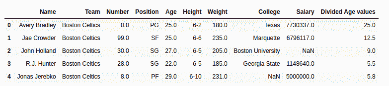
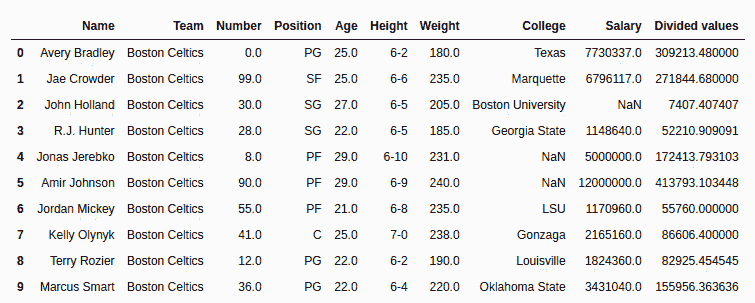

# Python | Pandas series . div()

> 原文:[https://www.geeksforgeeks.org/python-pandas-series-div/](https://www.geeksforgeeks.org/python-pandas-series-div/)

Python 是进行数据分析的优秀语言，主要是因为以数据为中心的 Python 包的奇妙生态系统。 ***【熊猫】*** 就是其中一个包，让导入和分析数据变得容易多了。

Python **`Series.div()`** 是用来将系列或者类似的对象按照调用者系列进行等长的划分。

> **语法:** Series.div(其他，级别=无，fill _ value =无，轴=0)
> 
> **参数:**
> **其他:**其他系列或列表类型由调用者系列
> **进行划分 fill_value:** 值由系列/列表中的 NaN 在划分前进行替换
> **级别:**多指标情况下级别的整数值
> 
> **返回类型:**带分数值的调用者系列

要下载下例使用的数据集，点击这里的[。](https://media.geeksforgeeks.org/wp-content/uploads/nba.csv)
在下面的例子中，使用的数据框包含了一些 NBA 球员的数据。任何操作前的数据框图像附在下面。


**示例#1:** 按列表划分系列

在本例中，前 5 行使用存储在新变量中。head()方法。之后，创建一个相同长度的列表，并使用。div()方法

```py
# importing pandas module 
import pandas as pd

# reading csv file from url 
data = pd.read_csv("https://media.geeksforgeeks.org/wp-content/uploads/nba.csv")

# creating short data of 5 rows
short_data = data.head()

# creating list with 5 values
list =[1, 2, 3, 4, 5]

# Dividing by list data
# creating new column
short_data["Divided Age values"]= short_data["Age"].div(list)

# display
short_data
```

**输出:**
如输出图像所示，可以比较分割年龄值列的分割值为(年龄)/(列表)。


**示例 2:** 将系列除以具有空值的系列

在本例中，“工资”列除以“年龄”列。因为工资列也包含空值，所以默认情况下，无论除以什么，它都会返回 NaN。在本例中，传递 200000，用 200000 替换空值。

```py
# importing pandas module 
import pandas as pd

# reading csv file from url 
data = pd.read_csv("https://media.geeksforgeeks.org/wp-content/uploads/nba.csv")

# passing age series to variable
age = data["Age"]

# na replacement
na = 200000

# Dividing values
# storing to new column
data["Divided values"]= data["Salary"].div(other = age, fill_value = na)

# display
data.head(10)
```

**输出:**
如输出图像所示，在空值的情况下，除数值列有 200000 的除年龄列。
