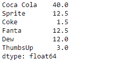
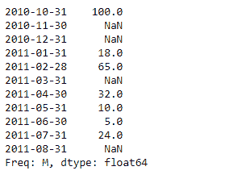
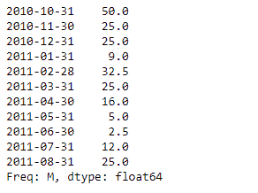

# 蟒蛇|熊猫系列. divide()

> 原文:[https://www.geeksforgeeks.org/python-pandas-series-divide/](https://www.geeksforgeeks.org/python-pandas-series-divide/)

熊猫系列是带有轴标签的一维数组。标签不必是唯一的，但必须是可散列的类型。该对象支持基于整数和基于标签的索引，并提供了一系列方法来执行涉及索引的操作。

熊猫 `**Series.divide()**`函数执行数列和其他元素的浮点除法(二进制运算符 truediv)。它相当于`series / other`，但支持用 fill_value 替换其中一个输入中缺失的数据。

> **语法:**系列。除(其他，级别=无，填充值=无，轴=0)
> 
> **参数:**
> **其他:**系列或标量值
> **fill_value :** 填充现有缺失(NaN)值。
> **级别:**跨级别广播，在传递的多索引级别上匹配索引值
> 
> **返回:**结果:系列

**示例#1:** 使用`Series.divide()`函数用标量对给定的序列对象执行浮点除法。

```
# importing pandas as pd
import pandas as pd

# Creating the Series
sr = pd.Series([80, 25, 3, 25, 24, 6])

# Create the Index
index_ = ['Coca Cola', 'Sprite', 'Coke', 'Fanta', 'Dew', 'ThumbsUp']

# set the index
sr.index = index_

# Print the series
print(sr)
```

**输出:**


现在我们将使用`Series.divide()`函数用标量对给定的序列对象执行浮点除法。

```
# perform floating division
result = sr.divide(other = 2)

# Print the result
print(result)
```

**输出:**

正如我们在输出中看到的，`Series.divide()`函数已经成功地用标量对给定的序列对象执行了浮点除法。

**示例 2 :** 使用`Series.divide()`函数对给定的序列对象执行标量的浮点除法。给定的序列对象包含一些缺失的值。

```
# importing pandas as pd
import pandas as pd

# Creating the Series
sr = pd.Series([100, None, None, 18, 65, None, 32, 10, 5, 24, None])

# Create the Index
index_ = pd.date_range('2010-10-09', periods = 11, freq ='M')

# set the index
sr.index = index_

# Print the series
print(sr)
```

**输出:**



现在我们将使用`Series.divide()`函数用标量对给定的序列对象执行浮点除法。我们将在所有缺少值的地方填充 50。

```
# perform floating division
# fill 50 at the place of missing values
result = sr.divide(other = 2, fill_value = 50)

# Print the result
print(result)
```

**输出:**



正如我们在输出中看到的那样，`Series.divide()`函数已经成功地用标量执行了给定序列对象的浮点除法。