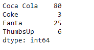
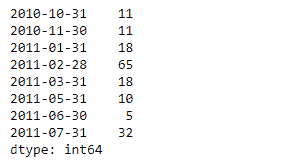

# 蟒蛇|熊猫系列. drop()

> 原文:[https://www.geeksforgeeks.org/python-pandas-series-drop/](https://www.geeksforgeeks.org/python-pandas-series-drop/)

熊猫系列是带有轴标签的一维数组。标签不必是唯一的，但必须是可散列的类型。该对象支持基于整数和基于标签的索引，并提供了一系列方法来执行涉及索引的操作。

熊猫 `**Series.drop()**`功能返回去除指定索引标签的系列。它基于指定索引标签来移除系列的元素。

> **语法:** Series.drop(标签=无，轴=0，索引=无，列=无，级别=无，位置=假，错误=“提升”)
> 
> **参数:**
> **标签:**指标标签要掉。
> **轴:**适用于系列产品。
> **索引，列:**对于在系列上的应用是多余的，但是可以使用索引来代替标签。
> **级别:**对于多索引，将移除标签的级别。
> **在位:**如果为真，在位进行操作，返回无。
> **错误:**如果‘忽略’，抑制错误，只丢弃现有标签。
> 
> **返回:**下降:熊猫。系列

**示例#1:** 使用`Series.drop()`函数删除给定序列对象中与传递的索引标签相对应的值。

```
# importing pandas as pd
import pandas as pd

# Creating the Series
sr = pd.Series([80, 25, 3, 25, 24, 6])

# Create the Index
index_ = ['Coca Cola', 'Sprite', 'Coke', 'Fanta', 'Dew', 'ThumbsUp']

# set the index
sr.index = index_

# Print the series
print(sr)
```

**输出:**


现在我们将使用`Series.drop()`函数删除给定序列对象中与传递的索引标签相对应的值。

```
# drop the passed labels
result = sr.drop(labels = ['Sprite', 'Dew']) 

# Print the result
print(result)
```

**输出:**


正如我们在输出中看到的，`Series.drop()`函数已经成功删除了与传递的索引标签相对应的条目。

**示例 2 :** 使用`Series.drop()`函数删除给定序列对象中与传递的索引标签相对应的值。

```
# importing pandas as pd
import pandas as pd

# Creating the Series
sr = pd.Series([11, 11, 8, 18, 65, 18, 32, 10, 5, 32, 32])

# Create the Index
index_ = pd.date_range('2010-10-09', periods = 11, freq ='M')

# set the index
sr.index = index_

# Print the series
print(sr)
```

**输出:**


现在我们将使用`Series.drop()`函数删除给定序列对象中与传递的索引标签相对应的值。

```
# drop the passed labels
result = sr.drop(labels = [pd.Timestamp('2010-12-31'),
                           pd.Timestamp('2011-04-30'), pd.Timestamp('2011-08-31')])

# Print the result
print(result)
```

**输出:**


正如我们在输出中看到的，`Series.drop()`函数已经成功删除了与传递的索引标签相对应的条目。