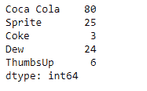
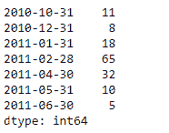

# Python | Pandas series . drop _ duplicates()

> 原文:[https://www . geesforgeks . org/python-pandas-series-drop _ duplicates/](https://www.geeksforgeeks.org/python-pandas-series-drop_duplicates/)

熊猫 `**Series.drop_duplicates()**`函数返回一个序列对象，从给定的序列对象中删除重复的值。

> **语法:**series . drop _ duplicates(keep = ' first '，inplace=False)
> 
> **参数:**
> **保留:** { '第一个'，'最后一个'，False}，默认为'第一个'
> **在位:**如果为真，在位执行操作，返回 None。
> 
> **返回:**已消除重复数据:系列

**示例#1:** 使用`Series.drop_duplicates()`函数删除给定序列对象中的重复值。

```
# importing pandas as pd
import pandas as pd

# Creating the Series
sr = pd.Series([80, 25, 3, 25, 24, 6])

# Create the Index
index_ = ['Coca Cola', 'Sprite', 'Coke', 'Fanta', 'Dew', 'ThumbsUp']

# set the index
sr.index = index_

# Print the series
print(sr)
```

**输出:**


现在我们将使用`Series.drop_duplicates()`函数删除给定序列对象的基础数据中的重复值。

```
# drop duplicates
result = sr.drop_duplicates()

# Print the result
print(result)
```

**输出:**

正如我们在输出中看到的那样，`Series.drop_duplicates()`函数已经成功删除了给定系列对象中的重复条目。

**示例 2 :** 使用`Series.drop_duplicates()`功能从给定的序列对象中删除重复的值。

```
# importing pandas as pd
import pandas as pd

# Creating the Series
sr = pd.Series([11, 11, 8, 18, 65, 18, 32, 10, 5, 32, 32])

# Create the Index
index_ = pd.date_range('2010-10-09', periods = 11, freq ='M')

# set the index
sr.index = index_

# Print the series
print(sr)
```

**输出:**

现在我们使用`Series.drop_duplicates()`函数删除给定序列对象底层数据中的重复值。

```
# drop duplicates
result = sr.drop_duplicates()

# Print the result
print(result)
```

**输出:**

正如我们在输出中看到的，`Series.drop_duplicates()`函数已经成功删除了给定系列对象中的重复条目。