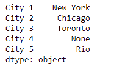
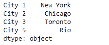
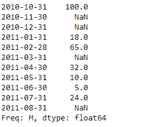
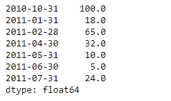

# Python |熊猫系列. dropna()

> 原文:[https://www.geeksforgeeks.org/python-pandas-series-dropna/](https://www.geeksforgeeks.org/python-pandas-series-dropna/)

熊猫系列是带有轴标签的一维数组。标签不必是唯一的，但必须是可散列的类型。该对象支持基于整数和基于标签的索引，并提供了一系列方法来执行涉及索引的操作。

熊猫 `**Series.dropna()**`函数返回一个新的序列，并删除给定序列对象中缺失的值。

> **语法:** Series.dropna(轴=0，inplace=False，**kwargs)
> 
> **参数:**
> **轴:**只有一个轴可以降值。
> **在位:**如果为真，在位进行操作，返回无。
> 
> **返回:**系列

**示例#1:** 使用`Series.dropna()`函数删除给定序列对象中缺失的值。

```
# importing pandas as pd
import pandas as pd

# Creating the Series
sr = pd.Series(['New York', 'Chicago', 'Toronto', None, 'Rio'])

# Create the Index
index_ = ['City 1', 'City 2', 'City 3', 'City 4', 'City 5'] 

# set the index
sr.index = index_

# Print the series
print(sr)
```

**输出:**


现在我们将使用`Series.dropna()`函数删除给定序列对象中所有缺失的值。

```
# drop the missing values
result = sr.dropna()

# Print the result
print(result)
```

**输出:**


正如我们在输出中看到的，`Series.dropna()`函数已经成功删除了给定序列对象中所有缺失的值。

**示例 2 :** 使用`Series.dropna()`功能删除给定序列对象中缺失的值。

```
# importing pandas as pd
import pandas as pd

# Creating the Series
sr = pd.Series([100, None, None, 18, 65, None, 32, 10, 5, 24, None])

# Create the Index
index_ = pd.date_range('2010-10-09', periods = 11, freq ='M')

# set the index
sr.index = index_

# Print the series
print(sr)
```

**输出:**


现在我们将使用`Series.dropna()`函数删除给定序列对象中所有缺失的值。

```
# drop the missing values
result = sr.dropna()

# Print the result
print(result)
```

**输出:**

正如我们在输出中看到的，`Series.dropna()`函数已经成功地删除了给定序列对象中所有缺失的值。