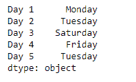
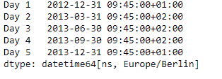
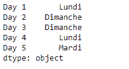

# 蟒蛇|熊猫系列. dt.day_name

> 原文:[https://www . geesforgeks . org/python-pandas-series-dt-day _ name/](https://www.geeksforgeeks.org/python-pandas-series-dt-day_name/)

`Series.dt`可用于访问系列的值，如 datetimelike，并返回几个属性。熊猫 `**Series.dt.day_name()**`函数返回指定地区的日期时间索引的日期名称。

> **语法:** Series.dt.day_name(*args，**kwargs)
> 
> **参数:**
> **地区:**地区确定返回日名的语言。默认为英语区域设置。
> 
> **返回:**日名称索引。

**示例#1:** 使用`Series.dt.day_name()`函数返回给定序列对象中基础日期时间数据的日期名称。用英语返回当天的名称。

```
# importing pandas as pd
import pandas as pd

# Creating the Series
sr = pd.Series(['2012-12-31 08:45', '2019-1-1 12:30', '2008-02-2 10:30',
                '2010-1-1 09:25', '2019-12-31 00:00'])

# Creating the index
idx = ['Day 1', 'Day 2', 'Day 3', 'Day 4', 'Day 5']

# set the index
sr.index = idx

# Convert the underlying data to datetime 
sr = pd.to_datetime(sr)

# Print the series
print(sr)
```

**输出:**


现在我们将使用`Series.dt.day_name()`函数返回给定系列对象中每个时间戳的日期名称。

```
# return day name in english
result = sr.dt.day_name(locale = 'English')

# print the result
print(result)
```

**输出:**



正如我们在输出中看到的那样，`Series.dt.day_name()`函数已经成功地以指定的语言返回了当天的名称。

**示例#2 :** 使用`Series.dt.day_name()`函数返回给定序列对象中基础日期时间数据的日期名称。用法语返回当天的名称。

```
# importing pandas as pd
import pandas as pd

# Creating the Series
sr = pd.Series(pd.date_range('2012-12-31 09:45', periods = 5, freq = 'Q',
                            tz = 'Europe / Berlin'))

# Creating the index
idx = ['Day 1', 'Day 2', 'Day 3', 'Day 4', 'Day 5']

# set the index
sr.index = idx

# Print the series
print(sr)
```

**输出:**



现在我们将使用`Series.dt.day_name()`函数返回给定系列对象中每个时间戳的日期名称。

```
# return day name in french
result = sr.dt.day_name(locale = 'French')

# print the result
print(result)
```

**输出:**



正如我们在输出中看到的那样，`Series.dt.day_name()`函数已经成功地以指定的语言返回了当天的名称。